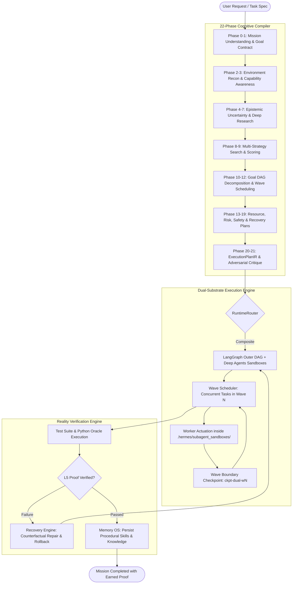

# Hermes AGI/ASI Autonomous Multi-Step Operating System & Harness

[](https://www.python.org/)
[](LICENSE)
[](#18-plane-master-operating-system)
[](#dual-substrate-execution-engine)
[](#reality-verification-engine-l0l6)
[-brightgreen.svg)](#verification--test-suites)

Hermes ASI-Master is a production-grade **Autonomous AGI/ASI Operating System & Multi-Step Execution Harness**. Designed for long-horizon autonomous software engineering, scientific research, and complex system operations, Hermes couples a **22-Phase Pre-Execution Cognitive Compiler** with a **Durable Dual-Substrate Execution Engine** (LangGraph outer cyclic DAG + Deep Agents isolated filesystem worker sandboxes).

---

## High-Level Architecture

```text
                                     HERMES ASI-MASTER
                                             │
                       ┌─────────────────────┴─────────────────────┐
                       │                                           │
             INTELLIGENCE OS                                  EXECUTION OS
                       │                                           │
         22-Phase Cognitive Compiler                    Universal RuntimeRouter
       (P0 Intent ──> P21 Plan Critique)                           │
                       │                        ┌──────────────────┼──────────────────┐
                       ▼                        │                  │                  │
               ExecutionPlanIR                  ▼                  ▼                  ▼
             • Mission Graph (DAG)          LangGraph         Deep Agents         Composite
             • Topological Waves             Adapter            Adapter         Dual-Substrate
             • Dynamic Context Budget           │                  │            (Recommended)
             • Capability Bindings              └──────────────────┼──────────────────┘
             • Recovery & Fallback Trees                           │
                                                                   ▼
                                                       Isolated Worker Sandboxes
                                                     (.hermes/subagent_sandboxes/)
                                                                   │
                                                ┌──────────────────┴──────────────────┐
                                                │                                     │
                                         DEVELOPER AGENCY                      DYNAMIC MCP HUB
                                        ToolEnvironmentOS                     CapabilityRegistry
                                       • write_file / edit_file               • connect_mcp_client()
                                       • grep_search / find_by_name           • Auto Tool Registration
                                       • execute_shell / git ops              • Dynamic Tool Manifests
```

---

## Key Subsystems

### 1. Dual-Substrate Execution Engine
Hermes resolves the tension between durable workflow orchestration and isolated agent execution:
- **LangGraph as Outer Durable Substrate**: Manages cyclic DAG state, wave scheduling, interrupt/resume mechanics, and durable boundary checkpoints (`ckpt-dual-<mission_id>-w<N>`).
- **Deep Agents as Inner Worker Substrate**: Spawns isolated filesystem worker sandboxes under `.hermes/subagent_sandboxes/<mission_id>/<worker_id>/` with task-local context packages, preserving lead context tokens and preventing token bloat.
- **Universal `RuntimeAdapter` SPI**: Decouples intelligence from execution. All substrates implement standard contracts (`compile_execution_substrate`, `execute_plan`, `pause`, `resume`).
- **Pluggable `RuntimeRouter`**: Dispatches execution dynamically between `CompositeDualSubstrateAdapter`, `LangGraphRuntimeAdapter`, `DeepAgentsRuntimeAdapter`, `PrimeRuntimeAdapter` (programmable Python REPL), and `OpenClawRuntimeAdapter` (distributed device mesh).

### 2. 22-Phase Cognitive Compiler (P0 to P21)
Before actuating tools or spawning workers, Hermes runs a full cognitive deliberation turn:
```text
┌──────────────────────────────────────────────────────────────────────────────────────────┐
│                           HERMES COGNITIVE COMPILER PHASES                               │
├──────────────────────────────────────────────────────────────────────────────────────────┤
│ P0  Mission Understanding   │ Intent extraction, implicit requirements, anti-goals       │
│ P1  Goal Construction       │ Target world state, immutable invariants, success metrics  │
│ P2  Environment Recon       │ Repos, filesystem, packages, services, git, MCP servers    │
│ P3  Capability Discovery    │ Models, agents, tools, on-demand skills, plugins, commands │
│ P4  Uncertainty Analysis    │ Epistemic classification: Known, Unknown, Contested        │
│ P5  Research Planning       │ Value of Information (VOI) scoring & research lanes        │
│ P6  Deep Research Engine    │ Multi-source search, document ingestion, claim gathering   │
│ P7  Knowledge Synthesis     │ Verified claim graph, world model update                   │
│ P8  Strategy Generation     │ Competing candidate strategies (Direct, Modular, Defend)   │
│ P9  Strategy Search & Eval  │ Multi-criteria scoring, branch pruning, simulation         │
│ P10 Goal Decomposition      │ Mission DAG: Objectives ──> Subgoals ──> Atomic Tasks      │
│ P11 Dependency Analysis     │ Graph edges: depends_on, blocks, enables, conflicts_with   │
│ P12 Parallelization         │ Topological sorting into Execution Waves (Wave 0, 1, 2...) │
│ P13 Agent Topology Design   │ 1 agent, planner-executor, lead-specialists, or swarm      │
│ P14 Model Routing           │ Frontier reasoning, coding, vision, or fast executor       │
│ P15 Capability Plan         │ Concrete tool, skill, plugin, and command bindings         │
│ P16 Resource Allocation     │ Token, time, CPU, GPU, memory, API quota budgets           │
│ P17 Risk & Safety Planning  │ Reversibility rating, side effects, policy gates           │
│ P18 Verification Planning   │ Verifiers, AST checks, holdout test suites designed ahead  │
│ P19 Recovery Planning       │ Primary strategy + Fallback A + Fallback B + Escalations   │
│ P20 Execution Compilation   │ Emits executable ExecutionPlanIR & Structured Blackboard   │
│ P21 Adversarial Critique    │ Red-team critique, invariant verification, approval gate   │
└──────────────────────────────────────────────────────────────────────────────────────────┘
```

### 3. Developer Agency Tool Suite ([`src/hermes_os/tool_env.py`](file:///c:/one/hermes-agi-asi-harness/src/hermes_os/tool_env.py))
Full agency toolchain built into `ToolEnvironmentOS` with side-effect governance:
- **`write_file(path, content, overwrite)`**: File creation and directory scaffolding.
- **`edit_file(path, target_content, replacement_content)`**: Surgical string replacement with regex/alias support (`old_str`/`new_str`).
- **`list_dir(path, recursive, max_depth)`**: Directory traversal with file metadata (size, type).
- **`grep_search(query, path, is_regex, case_sensitive)`**: Ripgrep-style pattern matching across files with line numbers.
- **`find_by_name(pattern, path)`**: Glob-based file discovery.
- **`execute_shell(command, timeout, cwd)`**: Sandboxed process execution governed by the cross-platform `SafetyKernel`.
- **`git_status()`, `git_diff()`, `apply_patch(patch_str)`**: Native workspace version control operations.

### 4. Memory OS Long-Term Disk Persistence ([`src/memory/manager.py`](file:///c:/one/hermes-agi-asi-harness/src/memory/manager.py))
Non-volatile disk persistence under `.hermes/memory/` across all 7 operational memory domains:
- **`semantic.jsonl`**: Concept embeddings and knowledge graph entries.
- **`episodic.jsonl`**: Chronological mission events, outcomes, and proof hashes.
- **`procedural.jsonl`**: Reusable skills, action sequences, and verified workflows.
- **`failure.jsonl`**: Failure signatures, root cause analyses, and countermeasures.
- **`decision.jsonl`**: Strategic decision records with rejected alternatives and rationales.
- **`world_state.jsonl`**: Environmental snapshots and historical world states.
- **`capability.jsonl`**: Empirical capability success rates and invocation metrics.
- **Auto-Hydration on Boot**: Automatically detects and loads existing memory on startup.

### 5. Empirical SWE-bench Benchmark Engine ([`src/hermes_agi/benchmarks/runner.py`](file:///c:/one/hermes-agi-asi-harness/src/hermes_agi/benchmarks/runner.py))
- **`run_empirical_task(task_spec)`**: Provisions an isolated workspace (`.hermes/benchmarks/{instance_id}`), initializes a baseline git repository, applies modifications/patches, executes test suites using `RealityVerificationEngine.verify_test_suite()`, and extracts unified git patches.
- **`run_swe_bench_suite(task_specs)`**: Executes multi-task benchmark suites and computes empirical resolution rates.

### 6. Dynamic MCP Server Hub & Capability Awareness ([`src/hermes_os/capabilities.py`](file:///c:/one/hermes-agi-asi-harness/src/hermes_os/capabilities.py))
- **`connect_mcp_client(client, server_name)`**: Auto-discovers exposed tools from active Model Context Protocol servers.
- **Dynamic Tool Registration**: Converts MCP tools into executable `ToolDescriptor`s and exposes them as `CapabilityKind.MCP` in `CapabilityRegistry`.
- **Pre-Execution Discovery**: The 22-phase Cognitive Compiler incorporates newly discovered MCP tools during Phase P2/P3 planning.

### 7. Reality Verification Engine (L0–L6 Tiers) ([`src/verification/vnext.py`](file:///c:/one/hermes-agi-asi-harness/src/verification/vnext.py))
Verifies completion across **3 Independent Dimensions**:
1. **Correctness**: Did the change produce the expected functional result?
2. **Completeness**: Did the change satisfy all acceptance criteria without omissions?
3. **Safety**: Were invariants preserved without anti-Goodhart gaming or adverse side-effects?

Generates tamper-resistant **Earned Completion Proofs** with cryptographic SHA-256 hashes across 7 independence tiers (L0 None $\to$ L1 Self-Check $\to$ L2 Clean Context $\to$ L3 Cross-Model $\to$ L4 Independent Reproduction $\to$ L5 Deterministic Compiler/Oracle $\to$ L6 External Sign-Off).

### 8. Pluggable Observability ([`src/hermes_os/telemetry.py`](file:///c:/one/hermes-agi-asi-harness/src/hermes_os/telemetry.py))
- Built-in **LangSmith Telemetry Exporter** mapping missions to root traces, waves to parent spans, and worker sandboxes to child spans.
- Integrated **Secret Scrubber** filtering API keys, tokens, and credentials from telemetry streams.
- **100% Offline Air-Gap Guarantee**: Gracefully switches to local JSONL trace logging when telemetry endpoints are unreachable.

---

## Autonomous Workflow Cycle



---

## Quick Start

### Installation

```bash
# Clone the repository
git clone https://github.com/itsPremkumar/hermes-agi-asi-harness.git
cd hermes-agi-asi-harness

# Install dependencies and package in editable mode
pip install -e .

# Optional extras: local Status API server, MCP tools, full dev suite
pip install -e ".[api]"
pip install -e ".[all]"
```

### Verify Your Installation

```bash
# Offline self-test with REAL asserts (no mocks, no network)
python -m hermes_agi self-test

# Full QA harness: CLI, imports, canonical map, lint scope, dep sync
python scripts/qa_harness.py .
```

### Python SDK Usage

#### 1. Running Missions with Dual-Substrate Execution

```python
import asyncio
from hermes_agi import Harness, HermesIntelligenceOS

async def main():
    # Initialize the Harness kernel
    harness = await Harness.create()

    # Run an autonomous mission across the Dual-Substrate runtime
    result = await harness.run(
        "Refactor auth module, add rate limiting, and verify test suite",
        mode="dual_substrate",
    )

    print("Status:", result["status"])
    print("Runtime Used:", result["execution_result"]["runtime_used"])
    print("Waves Completed:", result["execution_result"]["waves_completed"])
    print("Worker Sandboxes:", result["execution_result"]["worker_sandboxes"])
    print("Cryptographic Proof Hash:", result["execution_result"]["proof_hash"])

if __name__ == "__main__":
    asyncio.run(main())
```

#### 2. Using the Developer Agency Tool Suite

```python
import asyncio
from hermes_os.tool_env import ToolEnvironmentOS

async def main():
    tool_env = ToolEnvironmentOS(workspace_root=".")

    # 1. Write file
    await tool_env.execute_tool("write_file", {
        "path": "src/math_module.py",
        "content": "def add(a, b):\n    return a + b\n",
    })

    # 2. Grep search
    res = await tool_env.execute_tool("grep_search", {
        "query": "def add",
        "path": "src",
    })
    print("Matches:", res["result"])

    # 3. Surgical edit
    await tool_env.execute_tool("edit_file", {
        "path": "src/math_module.py",
        "old_str": "return a + b",
        "new_str": "return int(a) + int(b)",
    })

if __name__ == "__main__":
    asyncio.run(main())
```

#### 3. Running Empirical SWE-bench Evaluations

```python
import asyncio
import sys
from hermes_agi.benchmarks.runner import BenchmarkRunner

async def main():
    runner = BenchmarkRunner()

    task_spec = {
        "instance_id": "hermes__bugfix-01",
        "base_files": {
            "calc.py": "def multiply(a, b):\n    return a + b  # Buggy\n",
        },
        "solution_files": {
            "calc.py": "def multiply(a, b):\n    return a * b  # Fixed\n",
        },
        "test_command": [
            sys.executable,
            "-c",
            "import calc; assert calc.multiply(3, 4) == 12, '3 * 4 must equal 12'",
        ],
    }

    evaluation = await runner.run_empirical_task(task_spec)
    print("Benchmark Status:", evaluation["status"])
    print("Passed:", evaluation["passed"])
    print("Generated Patch:\n", evaluation["patch"])
    print("Earned Proof Hash:", evaluation["verification_proof"]["proof_hash"])

if __name__ == "__main__":
    asyncio.run(main())
```

#### 4. Persistent Memory OS Storage

```python
from memory.manager import MemoryOS

# Create MemoryOS instance
mem = MemoryOS(workspace_root=".")

# Store across memory domains
mem.semantic.store("LangGraph cyclic state graph semantics", tags=["langgraph", "runtime"])
mem.procedural.store_skill(
    name="surgical_patch",
    action_sequence=["grep_search", "edit_file", "verify_test_suite"],
)

# Save to .hermes/memory/*.jsonl
persisted = mem.save_to_disk()
print("Persisted memory files:", persisted)

# Re-opening a new MemoryOS instance automatically hydrates all records
new_mem = MemoryOS(workspace_root=".")
assert len(new_mem.semantic.search("LangGraph")) > 0
```

---

## CLI Reference

Hermes provides unified command-line interfaces across `hermes_agi` and `hermes_os`:

```bash
# Run task using Dual-Substrate (LangGraph + Deep Agents)
python -m hermes_agi run "refactor database client" --mode dual_substrate

# Run standard Harnix multi-step state graph
python -m hermes_agi run "write hello world in hello.py"

# Run autonomous overnight endurance loop (gnhf architecture)
python -m hermes_agi overnight "refactor codebase and improve test coverage" --max-iterations 10

# Conduct autonomous Deep Research
python -m hermes_agi research "autonomous agent runtime architectures" --depth 3

# Deliberate with Deep Thinking (Graph-of-Thought)
python -m hermes_agi think "design fault-tolerant consensus loop"

# Run Closed-Loop Recursive Self-Evolution (Darwin-Gödel Machine)
python -m hermes_agi evolve --cycles 3 --margin 0.015

# Check health and status across all planes
python -m hermes_agi status
python -m hermes_agi health

# Handle ANY task at ASI level (deliberate -> execute -> verify -> dossier,
# deliberation grounded in your live Hermes installation)
python -m hermes_agi asi "audit the auth module for injection risks"

# Show the read-only mirror of the live Hermes installation
# (profiles, skills, kanban boards, cron jobs — never writes)
python -m hermes_agi hermes context

# Serve the local Status API (needs the api extra: pip install -e ".[api]")
python -m hermes_agi api --port 8471

# Serve harness tools to Hermes Agent over MCP stdio
# (needs the mcp extra: pip install -e ".[mcp]")
python -m hermes_agi mcp-serve
```

---

## Verification & Test Suites

The test suite enforces a strict **100% pass guarantee** across all core planes, runtimes, adapters, and plugins:

```bash
# Run the complete test suite (81 tests)
pytest tests/test_hermes_v8_planes.py \
       tests/test_hermes_v9_runtime_adapters.py \
       tests/test_hermes_langsmith.py \
       tests/test_hermes_v10_production_asi.py \
       tests/test_hermes_v11_frontier_expansion.py \
       tests/unit/ \
       tests/test_working_plugins.py -v
```

### Test Coverage Summary

| Test Suite | Scope | Result |
| :--- | :--- | :--- |
| `tests/test_hermes_v11_frontier_expansion.py` | Developer Agency, Persistent Memory, Dual-Substrate, SWE-bench, Dynamic MCP | **5 / 5 PASSED** |
| `tests/test_hermes_v10_production_asi.py` | Live LLM Brain, Sandboxes, L5 Verification, Windows Safety, Darwin-Gödel Machine | **11 / 11 PASSED** |
| `tests/test_hermes_v9_runtime_adapters.py` | Universal SPI, LangGraph, Deep Agents, Composite Dual-Substrate, RuntimeRouter | **7 / 7 PASSED** |
| `tests/test_hermes_langsmith.py` | Telemetry Exporter, Secret Scrubber, Spans, Dual-Substrate Tracing | **7 / 7 PASSED** |
| `tests/test_hermes_v8_planes.py` | 18 Planes, 6 Nested Control Loops, Universal Event Bus, Tycho Active Abstraction | **24 / 24 PASSED** |
| `tests/unit/` & `tests/test_working_plugins.py` | Core Plugins, Workflows, Recovery Engine, Multi-Agent Orchestrator | **27 / 27 PASSED** |
| **Combined Total** | **Full System Surface** | **81 / 81 PASSED (100%)** |

---

## Invariants & Design Principles

1. **Pre-Execution Deliberation**: No tool is actuated, code written, or worker spawned before completing the 22-phase Cognitive Compiler pass.
2. **Dual-Substrate Isolation**: Durable cyclic DAG state is preserved at wave boundaries in LangGraph, while worker actuation is strictly insulated within isolated subagent directories.
3. **Earned Completion Proofs**: A task is never marked "complete" based on model self-assertion. Completion requires deterministic compiler, AST, or test execution proofs (Tier L5).
4. **Non-Destructive Invariant**: Zero backward compatibility breaks. Offline air-gap fallbacks ensure 100% operability even when external networks or API endpoints are offline.

---

## License

Apache-2.0 License.

