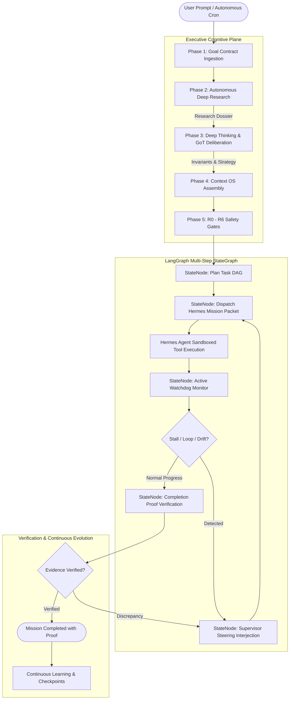

# Hermes AGI/ASI Autonomous Multi-Step Harness

A state-of-the-art **Executive AI Agent Harness** designed for multi-step autonomous operations, deep research, deliberate thinking, formal goal contracts, sandboxed tool execution, active supervisor monitoring, and evidence-backed completion proofs.

---

## Architecture Overview

```
src/
├── hermes_agi/                # Core Public Harness API, CLI, Planning, Workflow
│   ├── research/              # Deep Research Agent (autonomous fact gathering & dossiers)
│   ├── thinking/              # Deep Thinking & Graph-of-Thought (GoT) Deliberator
│   ├── allocation/            # Hermes Mission Packet Dispatch & Watchdog Monitor
│   ├── agents/                # Swarm Coordinator (26 Bot Profiles)
│   └── discovery/             # MetaDiscovery Engine (dynamic tool & feature catalog)
│
├── harnix/                    # LangGraph StateGraph Multi-Step Cognitive Runtime
│   ├── kernel.py              # HarnessRuntimeKernel (LangGraph StateGraph builder)
│   ├── nodes.py               # Cognitive & execution pure state nodes
│   └── state.py               # TypedDict AgentState schema & lifecycle phases
│
├── core/                      # Foundational runtime kernel (HermesKernel), supervisor, memory
├── plugins/                   # 130+ capability plugins (filesystem, shell, python, git, RAG, MCP)
├── engines/                   # Autonomous continuous dev, ultimate engine, & control plane
├── hermes_asi_master/         # 24/7 Watchdog, scheduler, and cron runtime
├── tools/                     # Tool registry and execution plane
│
└── domain modules:
    ├── arc_agi_3/             # ARC-AGI solver engine
    ├── daily_improvement/     # Continuous cycle & scheduler
    ├── deep_research/         # Deep research engine & UI
    ├── diagnostics/           # Runtime inspection & diagnostics
    ├── mesh/                  # Consensus engine & message router
    ├── safety/                # Risk assessor, policy enforcer, threat modeler
    ├── security/              # Security validator & audit
    ├── training/              # Self-training pipeline
    └── verification/          # Formal verification & multi-round proof facility
```

---

## The 8-Phase Executive Lifecycle



### 1. Goal Contract Ingestion
Unstructured requests are converted into a formal [`GoalContract`](file:///c:/one/hermes-agi-asi-harness/src/plugins/goal_contract/__init__.py) defining `desired_state`, measurable `success_criteria`, hard `failure_conditions`, approval requirements, and risk tiers (R0–R6).

### 2. Autonomous Deep Research
The [`DeepResearchAgent`](file:///c:/one/hermes-agi-asi-harness/src/hermes_agi/research/agent.py) conducts multi-phase investigation: decomposing unfamiliar topics, scanning dependencies, cataloging constraints, and assembling a verified `ResearchDossier`.

### 3. Deep Thinking & Graph-of-Thought (GoT) Deliberation
The [`DeepThinkingEngine`](file:///c:/one/hermes-agi-asi-harness/src/hermes_agi/thinking/engine.py) formulates:
- **3 Candidate Hypotheses**: (Direct, Robust Modular, Defensive Redundant).
- **Adversarial Critique Rounds**: Identifies failure modes, edge cases, and missing assumptions.
- **Formal Invariants**: Defines pre-conditions, post-conditions, and testable assertions.

### 4. Context OS Assembly
Consolidates short-term session state, semantic memory embeddings, active beliefs, git status, and sandboxed tool registries into a unified `MissionContext`.

### 5. Multi-Tier Safety Gates (R0 to R6)
Actions pass through 7 risk-verification gates (R0 Parse $\to$ R1 Understand $\to$ R2 Validate $\to$ R3 Safety $\to$ R4 Permission $\to$ R5 Verification $\to$ R6 Commit).

### 6. Hermes Mission Allocation
The harness constructs a [`HermesMissionPacket`](file:///c:/one/hermes-agi-asi-harness/src/hermes_agi/allocation/packet.py) with the goal contract, research dossier, thinking summary, plan steps, and tool whitelist, allocating the work to the Hermes AI Agent.

### 7. Active Watchdog Supervision
While Hermes executes, the [`HermesWatchdogMonitor`](file:///c:/one/hermes-agi-asi-harness/src/hermes_agi/allocation/monitor.py) streams real-time telemetry:
- **Heartbeat Tracking**: Flags unresponsive execution.
- **Stall & Loop Detection**: Detects repetitive tool calls with identical arguments.
- **Active Steering Interjections**: Injects guidance prompts into Hermes's message stream to redirect without aborting.

### 8. Evidence-Backed Completion Proof
"Done" is verified empirically through a [`CompletionProof`](file:///c:/one/hermes-agi-asi-harness/src/plugins/completion_proof/__init__.py): checksum verification, test suite exit codes, and cross-validation consensus scores across 3 isolated rounds.

---

## Quick Start

### Installation

```bash
# Clone the repository
git clone https://github.com/itsPremkumar/hermes-agi-asi-harness.git
cd hermes-agi-asi-harness

# Install dependencies and package in editable mode
pip install -e .
```

### Python SDK Usage

```python
import asyncio
from hermes_agi import Harness

async def main():
    # Initialize the Harness kernel
    harness = await Harness.create()
    
    # 1. Run an autonomous multi-step mission through LangGraph
    result = await harness.run("implement a robust microservice with unit tests")
    print("Status:", result["status"])
    print("Multi-step score:", result["multi_step"]["score"])
    print("Proof:", result["multi_step"]["proof"]["status"])
    
    # 2. Run autonomous Deep Research
    dossier = await harness.research("distributed consensus algorithms", depth=3)
    print("Research findings:", dossier["findings_count"])
    
    # 3. Deliberate with Deep Thinking & Graph-of-Thought
    thoughts = await harness.think("design event-driven telemetry stream")
    print("Selected strategy:", thoughts["selected_strategy"])
    print("Invariants:", thoughts["invariants_count"])
    
    # 4. Allocate a formal mission packet to Hermes
    allocation = await harness.allocate_hermes("refactor auth module", role="hermes-coder")
    print("Mission ID:", allocation["packet"]["mission_id"])

if __name__ == "__main__":
    asyncio.run(main())
```

---

## CLI Reference

The Harness provides a unified CLI via `python -m hermes_agi`:

```bash
# Run an autonomous multi-step mission
python -m hermes_agi run "write file output.txt containing HELLO"

# Run autonomous overnight endurance loop (gnhf architecture)
python -m hermes_agi overnight "refactor auth module and improve test coverage" --max-iterations 15
python -m hermes_agi gnhf "reduce complexity of codebase without changing functionality"

# Conduct autonomous Deep Research with live AgentEye search
python -m hermes_agi research "quantum computing algorithms" --depth 3

# Deliberate with Deep Thinking
python -m hermes_agi think "optimize database query caching"

# Allocate a mission packet to Hermes with watchdog monitoring
python -m hermes_agi allocate "implement rate limiter" --role hermes-coder

# Check system status and health
python -m hermes_agi status
python -m hermes_agi health

# Spawn a specialized agent from 26 bot profiles
python -m hermes_agi spawn coder "implement binary search tree"

# Run capacity evaluation benchmarks
python -m hermes_agi benchmark --name mmlu

# Discover tools, plugins, and capabilities
python -m hermes_agi discover "filesystem"
```

---

## Verification & Quality Assurance

Run the comprehensive test suites:

```bash
# 1. Master multi-round independent verification (3 rounds, cross-validated)
python run_verification.py

# 2. Executive agent test suite
pytest tests/test_executive_agent.py -v

# 3. Capacity benchmark tests
pytest tests/test_mmlu_benchmark.py tests/test_mmlu_gsm8k.py tests/test_real_toxicity_prompts.py -v

# 4. Kernel integration tests
python tests/test_kernel_integration.py

# 5. Runtime integration tests
python tests/test_runtime.py

# 6. Harness unit tests
pytest tests/unit/test_harness.py -v
```

---

## License

Apache-2.0 License.
