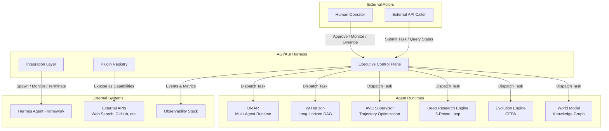
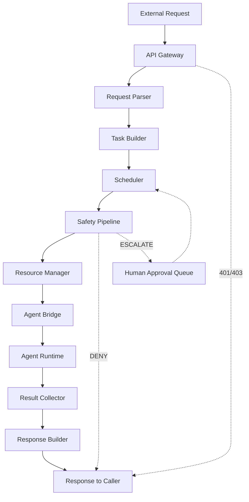

# 1. System Architecture Overview

## 1.1 Executive Summary

The Hermes AGI/ASI Harness is a unified control plane for orchestrating, monitoring, and governing advanced AI systems. It provides the executive function that sits above individual agent runtimes, providing safety guarantees, resource allocation, plugin extensibility, and integration with the Hermes agent framework.

This document describes the top-level architecture, key design decisions, and interfaces that enable the harness to coordinate multiple AI subsystems while maintaining human oversight and safety boundaries.

## 1.2 System Context (C4 Context Diagram)



## 1.3 Architectural Style

The harness follows a **layered microkernel architecture** with these layers:

| Layer | Components | Responsibility |
|-------|-----------|----------------|
| **Presentation** | API Gateway, CLI, Dashboard | External interface |
| **Control** | Scheduler, Resource Manager, Safety Governor | Executive decisions |
| **Communication** | Event Bus, Agent Bridge | Inter-component messaging |
| **Extension** | Plugin Registry, Plugin Sandbox | Capability extensibility |
| **Integration** | Hermes Bridge, External API Adapters | External system connectivity |
| **Runtime** | Agent Runtimes (DMAR, v9, AVO, etc.) | Task execution |
| **Infrastructure** | Storage, Networking, Observability | Platform services |

## 1.4 Key Design Decisions

### D1: Hierarchical Resource Budgeting
Resources are allocated at system → agent → task levels. Each level can borrow from unused parent allocations, but total consumption never exceeds system budget.

**Rationale**: Prevents any single task or agent from monopolizing resources while allowing flexibility for burst workloads.

### D2: Safety Gate Pipeline
Every action passes through a configurable chain of gates (Scope → Resource → Rate → Content → Privacy → Consent → Impact → Reversibility). Gates can approve, deny, escalate (require human), or modify an action.

**Rationale**: Defense in depth — multiple independent checks prevent single-point-of-failure safety gaps.

### D3: Event-Sourced State
All state changes are captured as immutable events on a durable, ordered, partitioned event bus. Current state is a projection of the event stream.

**Rationale**: Complete audit trail, ability to reconstruct state at any point in time, and natural support for CQRS patterns.

### D4: Plugin Sandboxing
Plugins run in isolated sandboxes with restricted filesystem, network, and resource access. Capability-based security model.

**Rationale**: Third-party plugins cannot compromise the harness or access unauthorized resources.

### D5: Preemptive Multitasking
Tasks can be safely preempted and resumed via checkpointing. Preemption depth is limited to 3 levels.

**Rationale**: High-priority tasks (e.g., safety interventions) can interrupt lower-priority work without data loss.

### D6: Active-Standby HA with Raft Consensus
The control plane runs in active-standby configuration with Raft consensus for state replication. Automatic failover on active failure.

**Rationale**: No single point of failure for control plane; consistent state across failovers.

## 1.5 Performance Targets

| Metric | Target | Measurement |
|--------|--------|-------------|
| Task submission latency | < 50ms p99 | API call to scheduler acceptance |
| Task dispatch latency | < 100ms p99 | Scheduling to agent start |
| Safety gate evaluation | < 10ms p99 | Full gate pipeline |
| Checkpoint write | < 100ms p99 | Persist checkpoint to storage |
| Recovery time (T1) | < 5 seconds | Detect and retry |
| Recovery time (T3) | < 30 seconds | Restart component and resume |
| Recovery time (T4) | < 2 minutes | Failover to standby control plane |
| Task throughput | 10,000 tasks/sec peak | Sustained dispatch rate |
| Agent capacity | 50+ concurrent agents | Active agent instances |

## 1.6 Technology Stack

| Concern | Technology | Rationale |
|---------|-----------|-----------|
| Runtime | Python 3.11+ | Async/await, rich ecosystem |
| API Framework | FastAPI | Async, OpenAPI, high performance |
| Message Bus | NATS / Redis Streams | Durable, ordered, partitioned |
| Consensus | Raft (via raft-rs or custom) | Proven correctness |
| Storage | SQLite (local) / PostgreSQL (HA) | Reliable, well-understood |
| Containerization | Docker + Kubernetes | Industry standard orchestration |
| Observability | OpenTelemetry + Prometheus | Vendor-neutral telemetry |
| Configuration | YAML + Pydantic | Type-safe, validated |

## 1.7 Failure Taxonomy

| Tier | Description | Examples | Recovery Strategy |
|------|-------------|----------|-------------------|
| T1: Transient | Self-recovering, short duration | Network timeout, rate limit | Automatic retry with backoff |
| T2: Degraded | Component impaired but functional | Slow LLM response, partial plugin failure | Retry + fallback to alternative |
| T3: Component loss | Entire component unavailable | Agent crash, plugin crash | Restart component, reassign tasks |
| T4: System failure | Multiple components affected | Control plane outage, storage failure | Failover to standby, enter safe mode |

## 1.8 Degradation Levels

| Level | Trigger | Behavior |
|-------|---------|----------|
| L0: Normal | All components healthy | Full functionality |
| L1: Reduced | One agent runtime down | Tasks rerouted to remaining agents |
| L2: Limited | Multiple agents down or plugin failures | Only critical tasks accepted; safety gates relaxed for low-risk actions |
| L3: Minimal | Control plane degraded | Agents continue current tasks; no new task acceptance |
| L4: Safe mode | System-wide failure | All agents suspended; state checkpointed; await operator intervention |

## 1.9 Request Lifecycle



## 1.10 Data Formats

### Task Object (Internal)

```python
@dataclass
class Task:
    id: str                          # UUID
    type: str                        # e.g., "research", "code", "evolution"
    payload: dict                    # Task-specific data
    priority: int                    # 0-10 (10 = highest)
    deadline: datetime               # Hard deadline
    estimated_cost: ResourceEstimate # Predicted consumption
    dependencies: list[str]          # Task IDs that must complete first
    auth_context: AuthContext        # AuthZ metadata
    metadata: dict                   # Extensible key-value pairs
```

### Event Object (on the bus)

```python
@dataclass
class HarnessEvent:
    event_id: str                    # UUID
    timestamp: datetime              # Event creation time
    event_type: str                  # e.g., "task.submitted", "safety.denied"
    source: str                      # Component that emitted
    task_id: str | None              # Associated task
    payload: dict                    # Event-specific data
    trace_id: str                    # Distributed tracing correlation
```

### Result Object (returned to caller)

```python
@dataclass
class TaskResult:
    task_id: str
    status: TaskStatus               # PENDING, RUNNING, COMPLETED, FAILED, CANCELLED
    output: dict                     # Task-specific output
    metrics: ExecutionMetrics        # Duration, token usage, etc.
    safety_events: list[SafetyEvent] # Safety decisions during execution
    error: str | None                # Error message if failed
```

## 1.11 State Categories

| Category | Storage | Recovery |
|----------|---------|----------|
| Ephemeral | In-memory | Recomputed on restart |
| Durable | SQLite/PostgreSQL | Restored from WAL |
| Replicated | Raft log across HA nodes | Replayed from leader |

State is checkpointed at critical transitions: task start, task completion, safety decision, resource allocation change, and plugin lifecycle events.

---

*Next: [Component Design Specifications](02-component-specs.md)*
