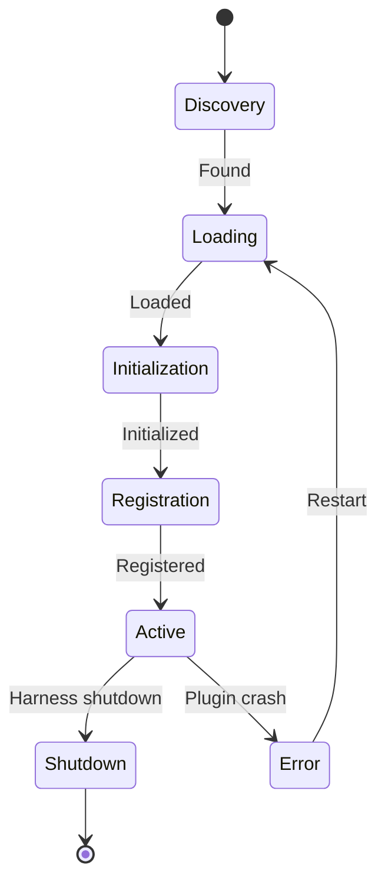

# 2. Component Design Specifications

This document details the design of each core harness component, including interfaces, algorithms, data structures, and interaction contracts.

---

## 2.1 Scheduler

### Purpose
Determines the order and priority of task execution across all connected agent runtimes.

### Interface

```python
class Scheduler:
    def submit_task(self, task: Task) -> TaskHandle:
        """Submit a task for scheduling. Returns a handle for status queries."""

    def cancel_task(self, task_id: str) -> bool:
        """Cancel a pending or running task."""

    def get_schedule(self) -> ScheduleSnapshot:
        """Get the current execution schedule."""

    def register_preempt_check(self, task_id: str, check: Callable[[], bool]):
        """Register a callback that determines if a task can be preempted."""

    def register_agent(self, agent_id: str, capabilities: AgentCapabilities):
        """Register an agent runtime with its capabilities."""

    def unregister_agent(self, agent_id: str):
        """Remove an agent from scheduling consideration."""
```

### Scheduling Algorithm

The harness uses a modified Earliest Deadline First (EDF) algorithm with priority inheritance. Each task computes a dynamic urgency score:

```
urgency = priority * 10 + deadline_pressure + dependency_pressure

where:
  deadline_pressure = max(0, 1.0 - (deadline - now) / max_window)
  dependency_pressure = sum(dep.urgency for dep in incomplete_deps) / max(1, len(dependencies))
```

Tasks are dispatched in urgency order. Preemption is allowed when:
1. A higher-urgency task arrives and all agents are busy
2. The current task exceeds its soft deadline
3. A safety gate requires immediate attention

### Preemption Protocol

```
1. Scheduler sends preempt_request to agent bridge
2. Agent bridge asks agent runtime to checkpoint state
3. Agent runtime serializes state (LLM context, partial results, tool outputs)
4. State persisted to durable storage
5. Task returned to scheduler queue with preempted status
6. Higher-priority task dispatched
7. Preempted task resumed from checkpoint when capacity available
```

### Data Structures

```python
@dataclass
class TaskHandle:
    task_id: str
    status: ScheduleStatus
    assigned_agent: str | None
    estimated_start: datetime | None

@dataclass
class ScheduleSnapshot:
    pending: list[Task]           # Not yet dispatched
    running: list[RunningTask]    # Currently executing
    preempted: list[Task]         # Suspended, awaiting resume
    completed_1min: int           # Throughput metric
    agents: list[AgentStatus]     # Agent capacity info
```

### Concurrency

- Lock-free priority queue (skiplist-based) for O(log n) insert/extract
- Single-writer per task ID for state mutations
- Compare-and-swap for atomic priority updates

---

## 2.2 Resource Manager

### Purpose
Allocates and tracks consumption of finite resources across all agent runtimes.

### Managed Resources

| Resource | Unit | Scope |
|----------|------|-------|
| LLM tokens | tokens/min | Per model, per agent |
| Wall time | seconds | Per task, per agent |
| Memory | GB | Per agent |
| API calls | requests/min | Per external service |
| Human attention | requests/hour | Per operator |

### Interface

```python
class ResourceManager:
    def allocate(self, agent_id: str, resource: str, amount: float) -> Allocation:
        """Allocate resources to an agent. Returns allocation handle."""

    def consume(self, agent_id: str, resource: str, amount: float) -> bool:
        """Record consumption. Returns False if over budget."""

    def get_utilization(self) -> UtilizationReport:
        """Get current utilization across all agents."""

    def set_budget(self, agent_id: str, resource: str, limit: float):
        """Set a resource budget for an agent."""

    def set_system_budget(self, resource: str, limit: float):
        """Set total system-wide resource limit."""

    def borrow_from_parent(self, agent_id: str, resource: str, amount: float) -> bool:
        """Attempt to borrow unused allocation from parent budget."""
```

### Budget Model

```
System Budget (total resources)
├── Agent A Budget
│   ├── Task 1 Budget
│   ├── Task 2 Budget
│   └── (unused → returnable to system)
├── Agent B Budget
│   ├── Task 3 Budget
│   └── (unused → returnable to system)
└── Emergency Reserve (5% — safety-critical only)
```

### Enforcement

| Limit Type | Behavior on Exceed |
|------------|-------------------|
| Soft limit | Warning + reduced allocation rate |
| Hard limit | Task suspension |
| Emergency reserve | Only for safety-critical operations |

### Data Structures

```python
@dataclass
class Allocation:
    allocation_id: str
    agent_id: str
    resource: str
    amount: float
    consumed: float
    expires_at: datetime | None

@dataclass
class UtilizationReport:
    agents: dict[str, AgentUtilization]
    system_total: dict[str, float]
    system_consumed: dict[str, float]
    emergency_reserve_used: dict[str, float]

@dataclass
class ResourceEstimate:
    llm_tokens: int | None
    wall_time_seconds: float | None
    memory_gb: float | None
    api_calls: dict[str, int] | None  # service → count
```

---

## 2.3 Safety Governor

### Purpose
Ensures no action is executed without passing through appropriate safety checks. The most critical component of the executive control plane.

### Interface

```python
class SafetyGovernor:
    def register_gate(self, gate: SafetyGate, priority: int):
        """Register a safety gate with priority (lower = earlier in pipeline)."""

    def check_action(self, action: Action, context: ActionContext) -> GateResult:
        """Check an action against all registered gates."""

    def get_gate_history(self, task_id: str) -> list[GateEvent]:
        """Get gate decision history for a task."""

    def register_emergency_stop(self, source: str, reason: str):
        """Activate emergency stop."""
```

### Gate Types

| Gate | Check | Failure Mode |
|------|-------|--------------|
| ScopeGate | Is action in authorized scope? | Deny |
| ResourceGate | Are resources available? | Deny or queue |
| RateGate | Is rate limit exceeded? | Delay |
| ContentGate | Is content safe? | Deny |
| PrivacyGate | Is PII protected? | Deny |
| ConsentGate | Is user consent obtained? | Escalate |
| ImpactGate | Is impact within bounds? | Escalate if high |
| ReversibilityGate | Is action reversible? | Escalate if irreversible |

### Gate Pipeline Implementation

```python
class SafetyGatePipeline:
    def __init__(self):
        self.gates: list[tuple[int, SafetyGate]] = []

    def add_gate(self, gate: SafetyGate, priority: int):
        self.gates.append((priority, gate))
        self.gates.sort(key=lambda x: x[0])

    async def check(self, action: Action, context: ActionContext) -> GateResult:
        for priority, gate in self.gates:
            result = await gate.check(action, context)
            if result.decision == GateDecision.DENY:
                return GateResult(decision=GateDecision.DENY,
                                  reason=f"Denied by {gate.name}: {result.reason}")
            if result.decision == GateDecision.ESCALATE:
                return GateResult(decision=GateDecision.ESCALATE,
                                  reason=f"Escalated by {gate.name}: {result.reason}")
            if result.decision == GateDecision.MODIFY:
                action = result.modified_action
        return GateResult(decision=GateDecision.APPROVE)
```

### Gate Decision Model

```python
class GateDecision(Enum):
    APPROVE = "approve"
    DENY = "deny"
    ESCALATE = "escalate"  # Requires human approval
    MODIFY = "modify"      # Allow with modifications

@dataclass
class GateResult:
    decision: GateDecision
    reason: str
    modified_action: Action | None = None
    gate_name: str = ""
    timestamp: datetime = field(default_factory=datetime.utcnow)
```

### Emergency Stop (E-Stop)

Activation methods:
- Physical button (dedicated hardware)
- Software command (CLI/API)
- Automatic trigger (safety threshold exceeded)
- Remote command (authorized operator)

Behavior on e-stop:
1. All running tasks immediately suspended
2. New task submissions rejected
3. All plugins notified to enter safe mode
4. State checkpointed
5. Operators notified

### Multi-Layer Safety

| Layer | Mechanism | Block Behavior |
|-------|-----------|---------------|
| Input validation | Schema validation, injection detection | Reject malformed |
| Action constraints | Scope, resource, rate gates | Deny unauthorized |
| Output filtering | PII redaction, content scanning | Block harmful output |
| Behavioral monitoring | Anomaly detection on agent behavior | Alert + throttle |
| Human oversight | Approval queue, emergency stop | Manual override |

---

## 2.4 Event Bus

### Purpose
Central nervous system of the harness. All components publish events and subscribe to events they care about.

### Characteristics

- **Durable**: Events persisted to write-ahead log before acknowledgment
- **Ordered**: Events within a single task ID are strictly ordered
- **Partitioned**: Events partitioned by task ID for parallel consumption
- **Replayable**: Consumers can replay events from any point in time

### Interface

```python
class EventBus:
    async def publish(self, event: HarnessEvent) -> str:
        """Publish an event. Returns event ID."""

    async def subscribe(self, event_types: list[str], handler: Callable[[HarnessEvent], Awaitable[None]]):
        """Subscribe to events of given types."""

    async def replay(self, task_id: str, from_timestamp: datetime) -> AsyncIterator[HarnessEvent]:
        """Replay events for a task from a given timestamp."""

    async def get_latest(self, task_id: str) -> HarnessEvent | None:
        """Get the most recent event for a task."""
```

### Key Event Types

| Event Type | Publisher | Subscribers |
|------------|-----------|-------------|
| `task.submitted` | API Gateway | Scheduler, Logger |
| `task.scheduled` | Scheduler | Resource Manager, Logger |
| `task.started` | Agent Bridge | Monitor, Logger |
| `task.progress` | Agent Runtime | Monitor, Logger |
| `task.completed` | Result Collector | Scheduler, Resource Manager, Logger |
| `task.failed` | Agent Runtime | Scheduler, Recovery Manager, Logger |
| `task.preempted` | Scheduler | Resource Manager, Logger |
| `task.resumed` | Scheduler | Resource Manager, Logger |
| `safety.decision` | Safety Governor | Logger, Audit Trail |
| `safety.emergency_stop` | Safety Governor | All Components |
| `resource.consumed` | Resource Manager | Monitor, Logger |
| `resource.budget_exceeded` | Resource Manager | Safety Governor, Logger |
| `plugin.loaded` | Plugin Registry | Logger |
| `plugin.error` | Plugin Sandbox | Logger, Alert Manager |
| `agent.heartbeat` | Agent Runtime | Monitor, Logger |
| `agent.lost` | Monitor | Scheduler, Recovery Manager, Logger |

### Partitioning Strategy

```
Partition = hash(task_id) % num_partitions

Within partition: events ordered by timestamp
Across partitions: no ordering guarantee (by design, for parallelism)
```

### Storage

- Write-ahead log (WAL) for incoming events
- Periodic compaction: aggregate events into state snapshots
- Retention: 7 days for raw events, 30 days for aggregated metrics
- Compression: zstd for archived events

---

## 2.5 Plugin Registry

### Purpose
Manages plugin discovery, loading, lifecycle, and sandboxing.

### Plugin Types

| Type | Purpose | Example |
|------|---------|---------|
| Capability | Add new actions | Web search, code execution |
| Provider | Connect to external services | OpenAI, Anthropic, Google |
| Safety | Add new safety gates | Bias detection, content filtering |
| Integration | Connect to external systems | Slack, GitHub, Jira |
| Monitoring | Add observability | Custom metrics, tracing |

### Plugin Lifecycle



### Plugin Manifest

```yaml
name: web-search-plugin
version: 1.2.0
type: capability
description: Web search via Brave Search API
author: DMAR Team
permissions:
  - network:outbound
  - secrets:brave_api_key
safety:
  input_validation: strict
  output_sanitization: html_escape
  max_requests_per_minute: 60
dependencies:
  - name: http-client
    version: ">=1.0"
hooks:
  - event: harness.startup
    handler: initialize
  - event: harness.shutdown
    handler: cleanup
```

### Interface

```python
class Plugin(ABC):
    @abstractmethod
    def get_manifest(self) -> PluginManifest:
        """Return plugin manifest."""

    @abstractmethod
    def initialize(self, context: PluginContext) -> None:
        """Initialize the plugin."""

    @abstractmethod
    def shutdown(self) -> None:
        """Clean up plugin resources."""

class CapabilityPlugin(Plugin):
    @abstractmethod
    def get_capabilities(self) -> list[Capability]:
        """Return capabilities provided by this plugin."""

    @abstractmethod
    def execute(self, capability: str, params: dict, context: ExecutionContext) -> ExecutionResult:
        """Execute a capability."""

class PluginRegistry:
    def discover(self) -> list[PluginManifest]:
        """Discover available plugins from all sources."""

    def load(self, manifest: PluginManifest) -> LoadedPlugin:
        """Load and initialize a plugin."""

    def unload(self, plugin_id: str):
        """Gracefully unload a plugin."""

    def get_capabilities(self) -> list[Capability]:
        """Get all registered capabilities."""

    def resolve_dependencies(self, manifest: PluginManifest) -> list[PluginManifest]:
        """Resolve plugin dependency graph."""
```

### Sandboxing

Plugins run in isolated sandboxes with:
- Restricted filesystem (read-only except designated scratch directories)
- Network access limited to declared endpoints
- Memory limits enforced by runtime
- CPU time limits per invocation
- No access to harness internal state (except via plugin context)

### Discovery Mechanisms

| Source | Description |
|--------|-------------|
| Built-in | Shipped with harness (core capabilities) |
| Installed | Via package manager (pip, npm) |
| External | Remote registries (with signature verification) |
| Development | Local filesystem (for development) |

---

## 2.6 Hermes Bridge

### Purpose
Translates between harness protocols and Hermes agent framework APIs.

### Interface

```python
class HermesBridge:
    def __init__(self, harness: Harness, hermes_client: HermesClient):
        self.harness = harness
        self.hermes = hermes_client
        self._agent_map: dict[str, str] = {}  # harness_task_id -> hermes_agent_id

    async def spawn_agent(self, task: Task) -> str:
        """Spawn a Hermes agent for a harness task."""

    async def monitor_agent(self, task_id: str) -> AgentStatus:
        """Monitor a Hermes agent."""

    async def terminate_agent(self, task_id: str):
        """Terminate a Hermes agent."""

    async def checkpoint_agent(self, task_id: str) -> Checkpoint:
        """Request checkpoint from a Hermes agent."""

    async def restore_agent(self, task_id: str, checkpoint: Checkpoint):
        """Restore a Hermes agent from checkpoint."""
```

### Communication Patterns

| Pattern | Use Case | Behavior |
|---------|----------|----------|
| Synchronous | Safety checks before action | Block until response |
| Asynchronous | Monitoring, logging | Fire-and-forget |
| Streaming | Real-time agent output | WebSocket/SSE |

### Hermes Capability Mapping

| Hermes Capability | Harness Plugin | Safety Gate |
|-------------------|----------------|-------------|
| Tool execution | ToolExecutionPlugin | Scope + Content |
| File access | FileAccessPlugin | Privacy + Scope |
| Web search | WebSearchPlugin | Rate + Content |
| Code execution | CodeExecutionPlugin | Scope + Impact |
| Memory access | MemoryAccessPlugin | Privacy + Consent |
| Cron scheduling | CronPlugin | Rate + Scope |

---

*Next: [Integration Patterns](03-integration-patterns.md)*
