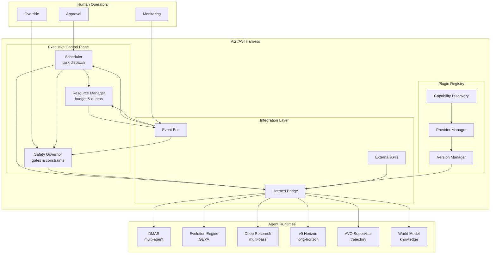
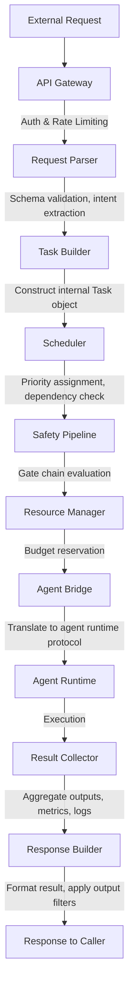

# AGI/ASI Harness — System Architecture Document

**Document ID:** HARNESS-SYSARCH-001
**Version:** 1.0.0
**Date:** 2026-08-30
**Author:** agent-architect (Hermes Kanban)
**Classification:** Design Specification

---

## 1. Executive Summary

The AGI/ASI Harness is a unified control plane for orchestrating, monitoring, and governing advanced AI systems. It provides executive function above individual agent runtimes, delivering safety guarantees, resource allocation, plugin extensibility, and integration with the Hermes agent framework.

This document describes the complete system architecture, including component interactions, data flows, concurrency model, failure recovery, scaling strategy, and security posture.

---

## 2. Design Principles

The harness is built on six core principles:

1. **Safety by default** — Every action passes through safety gates; nothing executes without explicit authorization
2. **Composability** — Capabilities are built from small, testable components that compose into larger workflows
3. **Observability** — Every decision, resource allocation, and safety check is logged and auditable
4. **Extensibility** — New capabilities are added via plugins without modifying core harness code
5. **Graceful degradation** — When components fail, the system degrades safely rather than catastrophically
6. **Human oversight** — Critical decisions require human approval; the system can recommend but not autonomously execute high-stakes actions

---

## 3. System Context



---

## 4. Executive Control Plane

### 4.1 Scheduler

The scheduler determines the order and priority of task execution across all connected agent runtimes.

**Key responsibilities:**
- Priority-based task dispatch with preemption support
- Deadline awareness (tasks have soft and hard deadlines)
- Dependency resolution (task B can't start until task A completes)
- Fairness guarantees (no single agent runtime can starve others)

**Scheduling algorithm:**
Modified Earliest Deadline First (EDF) with priority inheritance.

```python
urgency = priority * 10 + deadline_pressure + dependency_pressure

where:
  deadline_pressure = max(0, 1.0 - (deadline - now) / max_window)
  dependency_pressure = sum(dep.urgency for dep in incomplete_dependencies) / max(1, len(dependencies))
```

**Interfaces:**
```python
class Scheduler:
    def submit_task(self, task: Task) -> TaskHandle:
        """Submit a task for scheduling."""

    def cancel_task(self, task_id: str) -> bool:
        """Cancel a pending or running task."""

    def get_schedule(self) -> ScheduleSnapshot:
        """Get the current execution schedule."""

    def register_preempt_check(self, task_id: str, check: Callable[[], bool]):
        """Register a callback that determines if a task can be preempted."""
```

### 4.2 Resource Manager

Allocates and tracks consumption of finite resources across all agent runtimes.

**Managed resources:**
- **LLM tokens**: Input/output token budgets per time window (per model, per agent)
- **Wall time**: Maximum execution time per task and per agent
- **Memory**: RAM and storage limits per agent
- **External API calls**: Rate limits for web search, APIs, etc.
- **Human attention**: Number of approval requests per time window

**Budget model:**
Resources are allocated hierarchically:
1. **System budget**: Total resources available to the harness
2. **Agent budget**: Resources allocated to each agent runtime
3. **Task budget**: Resources allocated to individual tasks

**Enforcement:**
- Soft limits trigger warnings and reduced allocation
- Hard limits trigger task suspension or termination
- Emergency reserves (5% of total) are reserved for safety-critical operations

**Interfaces:**
```python
class ResourceManager:
    def allocate(self, agent_id: str, resource: str, amount: float) -> Allocation:
        """Allocate resources to an agent."""

    def consume(self, agent_id: str, resource: str, amount: float) -> bool:
        """Record resource consumption. Returns False if over budget."""

    def get_utilization(self) -> UtilizationReport:
        """Get current resource utilization across all agents."""

    def set_budget(self, agent_id: str, resource: str, limit: float):
        """Set a resource budget for an agent."""
```

### 4.3 Safety Governor

Ensures that no action is executed without passing through appropriate safety checks.

**Safety gate model:**
Every action passes through a chain of safety gates. Each gate can:
- **Approve**: Allow the action to proceed
- **Deny**: Block the action permanently
- **Escalate**: Require human approval before proceeding
- **Modify**: Allow the action with modifications

**Gate types:**

| Gate | Purpose | Action on Failure |
|------|---------|-------------------|
| Scope gate | Verify action is within authorized scope | Deny |
| Resource gate | Verify sufficient resources are available | Deny or queue |
| Rate gate | Prevent action flooding | Delay or deny |
| Content gate | Check for harmful content | Deny or escalate |
| Privacy gate | Prevent data exfiltration | Deny |
| Consent gate | Verify user consent for action | Escalate |
| Impact gate | Assess potential impact of action | Escalate if high |
| Reversibility gate | Verify action is reversible | Escalate if irreversible |

**Gate composition:**
Gates are composed into pipelines. Example for "create agent":
```
Scope → Resource → Rate → Impact → Consent → Execute
```

**Interfaces:**
```python
class SafetyGovernor:
    def register_gate(self, gate: SafetyGate, priority: int):
        """Register a safety gate."""

    def check_action(self, action: Action, context: ActionContext) -> GateResult:
        """Check an action against all registered gates."""

    def get_gate_history(self) -> list[GateEvent]:
        """Get history of gate decisions."""

class SafetyGate:
    def check(self, action: Action, context: ActionContext) -> GateDecision:
        """Check an action. Returns APPROVE, DENY, ESCALATE, or MODIFY."""
```

---

## 5. Data Flow

### 5.1 Request Lifecycle

Every external request follows a deterministic pipeline:



### 5.2 Data Formats

**Task object (internal):**
```python
@dataclass
class Task:
    id: str
    type: str
    payload: dict
    priority: int
    deadline: datetime
    estimated_cost: ResourceEstimate
    dependencies: list[str]
    auth_context: AuthContext
    metadata: dict
```

**Event object (on the bus):**
```python
@dataclass
class HarnessEvent:
    event_id: str
    timestamp: datetime
    event_type: str  # task.submitted, task.started, task.completed, safety.denied, etc.
    source: str  # component that emitted the event
    task_id: str | None
    payload: dict
    trace_id: str  # for distributed tracing
```

**Result object (returned to caller):**
```python
@dataclass
class TaskResult:
    task_id: str
    status: TaskStatus
    output: dict
    metrics: ExecutionMetrics
    safety_events: list[SafetyEvent]
    error: str | None
```

### 5.3 Event Bus

**Bus characteristics:**
- **Durable**: Events are persisted to write-ahead log before acknowledgment
- **Ordered**: Events within a single task ID are strictly ordered
- **Partitioned**: Events are partitioned by task ID for parallel consumption
- **Replayable**: Consumers can replay events from any point in time

**Key event types:**

| Event Type | Publisher | Subscribers |
|------------|-----------|-------------|
| `task.submitted` | API Gateway | Scheduler, Logger |
| `task.scheduled` | Scheduler | Resource Manager, Logger |
| `task.started` | Agent Bridge | Monitor, Logger |
| `task.progress` | Agent Runtime | Monitor, Logger |
| `task.completed` | Result Collector | Scheduler, Resource Manager, Logger |
| `task.failed` | Agent Runtime | Scheduler, Recovery Manager, Logger |
| `safety.decision` | Safety Governor | Logger, Audit Trail |
| `resource.consumed` | Resource Manager | Monitor, Logger |
| `plugin.loaded` | Plugin Registry | Logger |
| `plugin.error` | Plugin Sandbox | Logger, Alert Manager |

### 5.4 State Management

**Ephemeral state** (in-memory, lost on restart):
- Current schedule queue
- Active safety gate evaluations
- Agent heartbeat timestamps

**Durable state** (persisted to storage):
- Task definitions and history
- Safety gate decisions (audit trail)
- Resource consumption logs
- Plugin manifests and configurations
- Checkpoints for running tasks

**Replicated state** (across HA nodes):
- Scheduler state (which tasks are assigned to which agents)
- Safety governor configuration
- Resource budget allocations

---

## 6. Concurrency Model

### 6.1 Concurrency Primitives

**Async I/O layer:**
All inter-component communication uses async/await patterns. The harness runtime is built on an async event loop that handles thousands of concurrent connections without thread-per-connection overhead.

**Task layer:**
Each submitted task is an independent async operation. The scheduler manages a priority queue of pending tasks and dispatches them to agent runtimes as capacity becomes available.

**Agent layer:**
Agent runtimes may spawn multiple concurrent sub-operations (e.g., parallel web searches, batched LLM calls). The harness tracks these as child operations of the parent task.

### 6.2 Task Preemption

**Preemption conditions:**
- A higher-priority task arrives and all agents are busy
- The current task exceeds its soft deadline
- A safety gate requires immediate attention

**Preemption protocol:**
1. Scheduler sends `preempt_request` to the agent bridge
2. Agent bridge asks the agent runtime to checkpoint state
3. Agent runtime serializes current state
4. State is persisted to durable storage
5. Task is returned to the scheduler queue with `preempted` status
6. Higher-priority task is dispatched
7. When capacity is available, the preempted task is resumed from checkpoint

**Preemption constraints:**
- Tasks must opt-in to preemption by implementing `checkpoint()` and `restore()` methods
- Maximum preemption depth is 3
- Preemption is disabled for tasks marked `non_preemptible`

### 6.3 Lock-Free Data Structures

To minimize contention in the hot path:
- **Task queue**: Lock-free priority queue (skiplist-based) for O(log n) insert/extract
- **Event bus**: Single-writer, multiple-reader ring buffer per partition
- **Metrics counters**: Atomic counters with periodic flush to durable storage
- **Agent registry**: Read-copy-update (RCU) for agent status lookups

### 6.4 Backpressure

**Upstream backpressure:**
- API gateway rejects requests when the task queue exceeds a high-water mark
- New task submissions receive HTTP 503 with a `Retry-After` header

**Internal backpressure:**
- Scheduler stops dispatching when all agents are at capacity
- Event bus consumers that fall behind receive reduced delivery rates
- Plugin invocations are throttled when plugin-specific rate limits are hit

**Downstream backpressure:**
- Agent runtimes signal reduced readiness when their internal queues are full
- LLM providers that return rate-limit errors trigger exponential backoff

### 6.5 Concurrency Safety

**Race condition prevention:**
- All state mutations go through a single-writer task per task ID
- Safety gate evaluations are serialized per task
- Resource allocations use compare-and-swap for atomic budget updates

**Deadlock prevention:**
- Lock ordering is enforced globally (scheduler → safety → resource → agent)
- All locks have timeouts (default 5 seconds)
- Deadlock detection runs periodically and resolves by aborting the younger transaction

---

## 7. Failure Recovery

### 7.1 Failure Taxonomy

| Tier | Description | Examples | Recovery Strategy |
|------|-------------|----------|-------------------|
| T1: Transient | Self-recovering, short duration | Network timeout, rate limit | Automatic retry with backoff |
| T2: Degraded | Component impaired but functional | Slow LLM response, partial plugin failure | Retry + fallback to alternative |
| T3: Component loss | Entire component unavailable | Agent crash, plugin crash | Restart component, reassign tasks |
| T4: System failure | Multiple components affected | Control plane outage, storage failure | Failover to standby, enter safe mode |

### 7.2 Checkpointing

**Checkpoint triggers:**
- Task state changes (start, progress milestone, completion)
- Safety gate decisions
- Resource allocation changes
- Plugin lifecycle events
- Periodic timer (every 30 seconds for active tasks)

**Checkpoint format:**
```python
@dataclass
class Checkpoint:
    checkpoint_id: str
    task_id: str
    timestamp: datetime
    component: str  # which component created the checkpoint
    state_blob: bytes  # serialized component state
    metadata: dict  # key-value pairs for searchability
```

**Checkpoint storage:**
- Written to local disk first (low latency)
- Replicated to shared storage (NFS, S3, etc.) for durability
- Retained for 7 days (configurable)
- Compressed using zstd for storage efficiency

### 7.3 Retry Strategy

```python
@dataclass
class RetryPolicy:
    max_attempts: int = 3
    initial_delay_seconds: float = 1.0
    max_delay_seconds: float = 60.0
    backoff_multiplier: float = 2.0
    jitter: bool = True
    retryable_exceptions: list[str] = ["TimeoutError", "RateLimitError", "ConnectionError"]
```

**Retry behavior:**
- T1 failures: Automatic retry up to `max_attempts` times
- T2 failures: Retry once, then fallback to alternative provider/component
- T3 failures: No retry; trigger component restart and task reassignment
- T4 failures: No retry; trigger system-level failover

### 7.4 Graceful Degradation

| Level | Trigger | Behavior |
|-------|---------|----------|
| L0: Normal | All components healthy | Full functionality |
| L1: Reduced | One agent runtime down | Tasks rerouted to remaining agents |
| L2: Limited | Multiple agents down or plugin failures | Only critical tasks accepted; safety gates relaxed for low-risk actions |
| L3: Minimal | Control plane degraded | Agents continue current tasks; no new task acceptance |
| L4: Safe mode | System-wide failure | All agents suspended; state checkpointed; await operator intervention |

**Degradation rules:**
- Safety gates are never bypassed, even in degraded mode
- Resource limits are enforced at all degradation levels
- Operators are notified immediately on any degradation
- Automatic recovery attempts begin immediately

### 7.5 Recovery Procedures

**Agent recovery:**
1. Detect agent failure (heartbeat timeout or error event)
2. Identify all tasks assigned to the failed agent
3. For each task: load latest checkpoint, reassign to healthy agent
4. Log the failure and recovery action
5. Alert operators if failure rate exceeds threshold

**Control plane recovery:**
1. Detect control plane failure (health check timeout)
2. Promote standby control plane to active
3. Standby loads latest replicated state
4. Reconnect all agent runtimes to new control plane
5. Resume task dispatching from where the previous control plane left off

**Storage recovery:**
1. Detect storage failure (write errors, checksum mismatches)
2. Switch to replica storage
3. Rebuild failed replica from healthy replicas
4. Verify data integrity after rebuild

---

## 8. Scaling Strategy

### 8.1 Scaling Dimensions

| Dimension | Target | Mechanism |
|-----------|--------|-----------|
| Task throughput | 10,000 tasks/second | Add more agent runtimes |
| Task complexity | 24 hours duration | Checkpoint and resume |
| Agent diversity | 50+ distinct types | Plugin system |

### 8.2 Horizontal Scaling

**Control plane scaling:**
- Active-standby configuration for HA (2 nodes minimum)
- Active-active for read-only operations (schedule queries, metrics)
- Write operations go through the active node only
- Raft consensus for state replication between nodes

**Agent runtime scaling:**
- Agent runtimes are stateless from the harness perspective
- New agent instances register with the control plane on startup
- Load balancing distributes tasks based on agent capacity and current load
- Auto-scaling based on queue depth

**Storage scaling:**
- Checkpoint storage: Sharded by task ID hash
- Event bus: Partitioned by task ID for parallel writes
- Metrics: Aggregated at the agent level before central storage

### 8.3 Vertical Scaling

**Per-agent scaling:**
- Agents can request additional resources for complex tasks
- Resource manager dynamically adjusts allocations based on demand
- Burst capacity available from shared pool

**Per-task scaling:**
- Tasks can spawn sub-agents for parallel sub-workflows
- Sub-agents inherit parent task's safety context
- Resource consumption is aggregated at the parent task level

### 8.4 Capacity Planning

```python
class CapacityPlanner:
    def estimate_task_cost(self, task_type: str, payload: dict) -> ResourceEstimate:
        """Estimate resource cost for a task based on historical data."""

    def forecast_capacity(self, horizon: timedelta) -> CapacityForecast:
        """Forecast capacity needs for the given horizon."""
```

**Scaling triggers:**
- **Scale out**: Pending task queue > 100 for > 30 seconds
- **Scale in**: Agent utilization < 20% for > 5 minutes
- **Emergency scale**: Pending task queue > 1000 (immediate scale-out)

### 8.5 Performance Targets

| Metric | Target | Measurement |
|--------|--------|-------------|
| Task submission latency | < 50ms p99 | Time from API call to scheduler acceptance |
| Task dispatch latency | < 100ms p99 | Time from scheduling to agent start |
| Safety gate evaluation | < 10ms p99 | Time for full gate pipeline |
| Checkpoint write | < 100ms p99 | Time to persist checkpoint to storage |
| Recovery time (T1) | < 5 seconds | Time to detect and retry |
| Recovery time (T3) | < 30 seconds | Time to restart component and resume tasks |
| Recovery time (T4) | < 2 minutes | Time to failover to standby control plane |

---

## 9. Security Model

### 9.1 Threat Model

| Threat | Mitigation |
|--------|------------|
| Unauthorized agent spawn | Scope gate + authentication |
| Resource exhaustion | Resource manager + rate gates |
| Data exfiltration | Privacy gate + output filtering |
| Prompt injection | Input validation + content gate |
| Privilege escalation | Plugin sandboxing + capability model |
| Denial of service | Rate limiting + circuit breakers |
| Man-in-the-middle | TLS + certificate pinning |

### 9.2 Authentication and Authorization

**Agent authentication:**
- Each agent has a unique identity (UUID)
- Agents authenticate via mTLS or API keys
- Agent permissions are scoped to authorized capabilities

**Operator authentication:**
- Human operators authenticate via SSO (OAuth2/OIDC)
- Role-based access control (RBAC) for different operator levels
- Multi-factor authentication for high-impact operations

**Authorization model:**
- Capability-based authorization (agents have explicit capabilities)
- Attribute-based access control (ABAC) for fine-grained policies
- Just-in-time elevation for temporary privilege increases

---

## 10. Future Directions

### 10.1 Near-term (0-6 months)
- Implement core executive control plane
- Build plugin system with sandboxing
- Integrate with Hermes agent framework
- Deploy single-node production instance

### 10.2 Medium-term (6-12 months)
- Multi-node deployment with HA
- Advanced safety gates (bias detection, fairness)
- Plugin marketplace for community contributions
- Integration with additional agent frameworks

### 10.3 Long-term (12+ months)
- Multi-region deployment with global safety policy
- Self-improving safety gates (learned from incidents)
- Formal verification of critical safety properties
- Autonomous safety research

---

## Appendix A: Glossary

| Term | Definition |
|------|------------|
| Harness | The executive control plane for AI systems |
| Plugin | An extension that adds capabilities to the harness |
| Gate | A safety check that actions must pass through |
| Agent | An AI system managed by the harness |
| Task | A unit of work submitted to the harness |
| Capability | An action that an agent or plugin can perform |
| E-stop | Emergency stop mechanism |
| Hermes | The agent framework that the harness integrates with |

## Appendix B: References

- NIST AI Risk Management Framework (AI RMF 1.0)
- EU AI Act (2024)
- Anthropic's Responsible Scaling Policy
- OpenAI's Preparedness Framework
- Google's AI Principles
