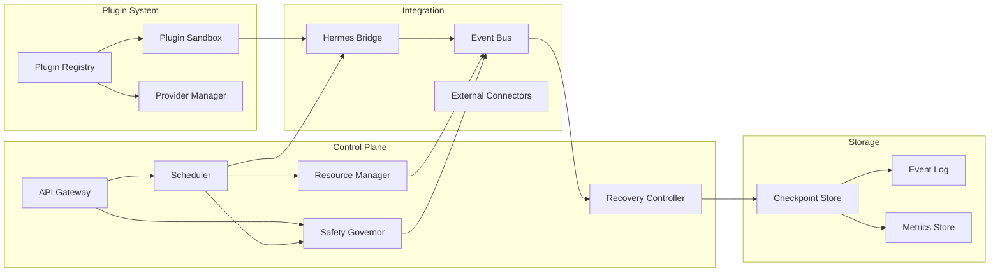
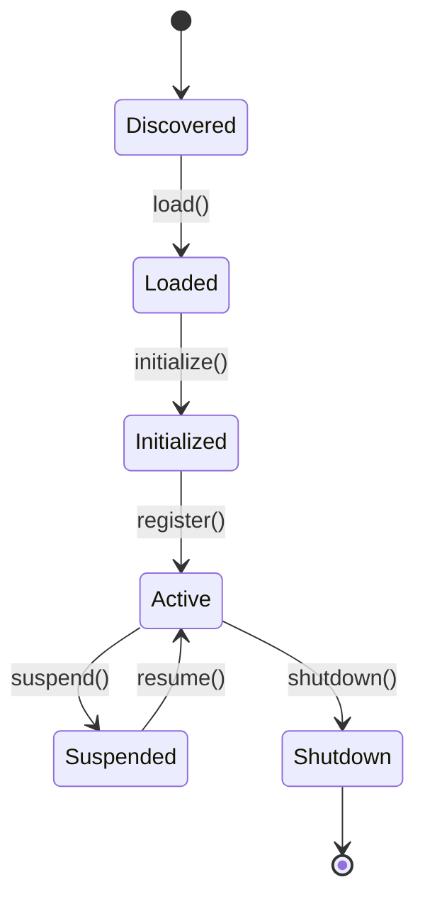
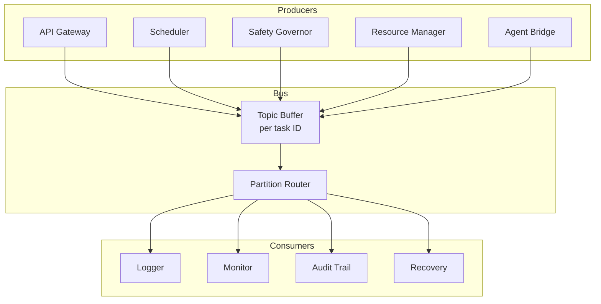

# AGI/ASI Harness — Component Design Specification

**Document ID:** HARNESS-COMP-001
**Version:** 1.0.0
**Date:** 2026-08-30
**Author:** agent-architect (Hermes Kanban)
**Classification:** Design Specification

---

## 1. Component Overview

The harness is decomposed into the following core components:



---

## 2. API Gateway

### 2.1 Responsibilities
- Accept incoming HTTP/gRPC requests
- Authenticate callers (API keys, mTLS, OAuth2 tokens)
- Rate limit requests per client
- Route requests to appropriate internal handlers
- Return structured responses (JSON/Protobuf)

### 2.2 API Endpoints

| Method | Path | Description |
|--------|------|-------------|
| POST | `/v1/tasks` | Submit a new task |
| GET | `/v1/tasks/{id}` | Get task status |
| DELETE | `/v1/tasks/{id}` | Cancel a task |
| GET | `/v1/schedule` | Get current schedule |
| GET | `/v1/agents` | List active agents |
| POST | `/v1/agents/{id}/terminate` | Terminate an agent |
| GET | `/v1/safety/history` | Get safety gate history |
| POST | `/v1/safety/estop` | Trigger emergency stop |
| POST | `/v1/safety/estop/reset` | Reset emergency stop |
| GET | `/v1/metrics` | Get system metrics |
| GET | `/v1/plugins` | List loaded plugins |
| POST | `/v1/plugins/{id}/load` | Load a plugin |
| DELETE | `/v1/plugins/{id}` | Unload a plugin |

### 2.3 Request/Response Formats

**Submit Task Request:**
```json
{
  "type": "research",
  "payload": {
    "query": "...",
    "max_passes": 5
  },
  "priority": 5,
  "deadline": "2026-08-31T12:00:00Z",
  "dependencies": [],
  "metadata": {
    "source": "user-interface"
  }
}
```

**Task Response:**
```json
{
  "task_id": "abc-123",
  "status": "queued",
  "estimated_start": "2026-08-30T10:05:00Z",
  "position_in_queue": 3
}
```

---

## 3. Scheduler

### 3.1 Internal State
```python
@dataclass
class SchedulerState:
    task_queue: PriorityQueue[Task]          # Pending tasks
    active_tasks: dict[str, ActiveTask]       # Currently executing
    preempted_stacks: dict[int, list[Task]]   # Stack per preemption depth
    agent_assignments: dict[str, str]         # agent_id -> task_id
    schedule_history: list[ScheduleEntry]     # For replay/audit
```

### 3.2 Dispatch Loop
```python
async def dispatch_loop(self):
    while True:
        task = await self.state.task_queue.extract_min()
        
        # Find best agent
        agent = self.select_agent(task)
        if agent is None:
            # All agents busy - consider preemption
            if task.urgency > self.preemption_threshold:
                victim = self.find_preemptable_victim(task)
                if victim:
                    await self.preempt(victim)
                    agent = self.select_agent(task)
        
        if agent:
            await self.assign(task, agent)
        else:
            # Re-queue with updated urgency
            task.urgency = self.recompute_urgency(task)
            await self.state.task_queue.insert(task)
            await asyncio.sleep(0.1)  # Back off
```

### 3.3 Agent Selection Strategy
1. Filter agents by capability match
2. Filter agents with available capacity
3. Score remaining agents by:
   - Current load (lower is better)
   - Historical performance on similar tasks
   - Resource cost (cheaper is better)
4. Select highest-scoring agent

---

## 4. Resource Manager

### 4.1 Resource Accounting
```python
@dataclass
class ResourceAccount:
    agent_id: str
    allocations: dict[str, float]   # resource -> allocated amount
    consumption: dict[str, float]   # resource -> consumed amount
    limits: dict[str, float]        # resource -> hard limit
    last_updated: datetime

    @property
    def available(self) -> dict[str, float]:
        return {
            r: self.allocations.get(r, 0) - self.consumption.get(r, 0)
            for r in self.limits
        }

    def can_allocate(self, resource: str, amount: float) -> bool:
        return self.available.get(resource, 0) >= amount
```

### 4.2 Token Budget Tracking
```python
class TokenBudget:
    def __init__(self, window_seconds: int = 60):
        self.window = window_seconds
        self.usage: list[tuple[datetime, int]] = []  # (timestamp, tokens)
    
    def consume(self, tokens: int):
        self.usage.append((datetime.now(), tokens))
        self._evict_old()
    
    def remaining(self) -> int:
        self._evict_old()
        used = sum(t for _, t in self.usage)
        return self.limit - used
    
    def _evict_old(self):
        cutoff = datetime.now() - timedelta(seconds=self.window)
        self.usage = [(ts, t) for ts, t in self.usage if ts > cutoff]
```

### 4.3 Budget Reclamation
Unused task budgets are reclaimed when:
- Task completes (remaining budget returned to agent pool)
- Task is cancelled or preempted
- Soft limit period expires (unused soft-limit allocations decay)

---

## 5. Safety Governor

### 5.1 Gate Pipeline Implementation
```python
class SafetyGatePipeline:
    def __init__(self):
        self.gates: list[tuple[int, SafetyGate]] = []

    def add_gate(self, gate: SafetyGate, priority: int):
        self.gates.append((priority, gate))
        self.gates.sort(key=lambda x: x[0])

    async def check(self, action: Action, context: ActionContext) -> GateResult:
        for priority, gate in self.gates:
            result = await gate.check(action, context)
            if result.decision == GateDecision.DENY:
                return GateResult(
                    decision=GateDecision.DENY,
                    reason=f"Denied by {gate.name}: {result.reason}",
                )
            if result.decision == GateDecision.ESCALATE:
                return GateResult(
                    decision=GateDecision.ESCALATE,
                    reason=f"Escalated by {gate.name}: {result.reason}",
                )
            if result.decision == GateDecision.MODIFY:
                action = result.modified_action
        return GateResult(decision=GateDecision.APPROVE)
```

### 5.2 Built-in Gate Implementations

**ScopeGate:**
- Checks action type against agent's authorized scope
- Scope is defined in agent configuration
- Denies actions not in scope

**ResourceGate:**
- Checks if resource manager can fulfill the request
- Denies if hard limit would be exceeded
- Queues if soft limit exceeded but hard limit OK

**RateGate:**
- Token bucket algorithm per action type
- Denies if bucket empty
- Auto-replenishes at configured rate

**ContentGate:**
- Pattern matching against known harmful content
- LLM-based classification for novel content
- Denies if confidence of harm exceeds threshold
- Escalates if uncertain

**PrivacyGate:**
- Regex-based PII detection (SSN, credit cards, emails)
- Entropy analysis for unknown PII patterns
- Denies if PII detected in output

**ConsentGate:**
- Checks user consent registry
- Escalates if consent not on file
- Denies if consent explicitly revoked

**ImpactGate:**
- Estimates blast radius of action
- Escalates if impact score > threshold
- Impact factors: data affected, reversibility, scope

**ReversibilityGate:**
- Checks if action has a rollback plan
- Escalates if irreversible
- Denies if irreversible AND high impact

---

## 6. Plugin System

### 6.1 Plugin Lifecycle



### 6.2 Plugin Manifest Schema
```yaml
name: string                    # Unique plugin name
version: string                 # Semver
type: enum                      # capability | provider | safety | integration | monitoring
description: string
author: string
permissions:
  - network:outbound            # Network access
  - filesystem:read             # Read filesystem
  - filesystem:write            # Write filesystem
  - secrets:<name>              # Access specific secret
safety:
  input_validation: enum        # none | strict | llm
  output_sanitization: enum     # none | html_escape | pii_redact
  max_requests_per_minute: int
dependencies:
  - name: string
    version: string             # Semver range
hooks:
  - event: string               # harness.startup | harness.shutdown | etc.
    handler: string             # Function name
```

### 6.3 Plugin Sandbox
- Each plugin runs in its own process/container
- Communication via gRPC or shared memory
- Resource limits enforced by cgroups/seccomp
- Filesystem access via overlay FS (read-only base + scratch layer)
- Network access via proxy with allowlist

---

## 7. Hermes Bridge

### 7.1 Bridge Responsibilities
- Translate harness task submissions into Hermes agent spawns
- Monitor Hermes agent status and report back to harness
- Route safety decisions to Hermes agents
- Collect resource consumption data from Hermes agents
- Handle Hermes agent lifecycle events

### 7.2 Communication Patterns

| Pattern | Use Case | Implementation |
|---------|----------|----------------|
| Synchronous | Safety checks before action | gRPC with timeout |
| Asynchronous | Monitoring, logging | Event bus publish |
| Streaming | Real-time agent output | Server-side streaming gRPC |

### 7.3 Agent Lifecycle Mapping

| Harness State | Hermes State |
|---------------|--------------|
| queued | (not yet spawned) |
| scheduled | (not yet spawned) |
| running | active |
| preempted | paused |
| completed | terminated |
| failed | crashed/terminated |

---

## 8. Event Bus

### 8.1 Bus Architecture


### 8.2 Event Schema
```python
@dataclass
class HarnessEvent:
    event_id: str           # UUID v4
    timestamp: datetime     # UTC with microsecond precision
    event_type: str         # Dot-separated hierarchical
    source: str             # Component identifier
    task_id: str | None     # Associated task (if any)
    payload: dict           # Event-specific data
    trace_id: str           # For distributed tracing (W3C Trace Context)
    span_id: str            # Span within trace
```

### 8.3 Partitioning Strategy
- Events partitioned by `task_id` hash
- 64 partitions default (configurable)
- Single-writer per partition (the component that owns the task)
- Multiple readers per partition (subscribers)

---

## 9. Recovery Controller

### 9.1 Failure Detection
- Heartbeat timeout: Agent must heartbeat every 10 seconds
- Missed heartbeats threshold: 3 consecutive misses = failure
- Health check interval: Control plane health checked every 5 seconds
- Storage check: Every write is verified with checksum

### 9.2 Recovery Actions

| Failure Type | Detection | Recovery Action |
|--------------|-----------|-----------------|
| Agent crash | Heartbeat timeout | Restart agent, resume from checkpoint |
| Agent stall | No progress for 60s | Terminate and restart agent |
| Plugin crash | Process exit | Restart plugin, drain in-flight requests |
| Control plane crash | Health check timeout | Failover to standby |
| Storage failure | Write error | Switch to replica, rebuild |
| Network partition | Connectivity loss | Enter degraded mode, queue events |

### 9.3 Checkpoint Restore Procedure
1. Load latest checkpoint for task
2. Verify checkpoint integrity (checksum)
3. Deserialize state blob
4. Find available agent with matching capabilities
5. Dispatch task with restored state
6. Resume from last completed step

---

## 10. Observability Stack

### 10.1 Logging
- Structured JSON logging
- Log levels: DEBUG, INFO, WARN, ERROR, FATAL
- All safety events logged at WARN or above
- All state changes logged at INFO
- Trace ID injected into every log line

### 10.2 Metrics
- Prometheus-compatible metrics endpoint
- Key metrics:
  - `harness_tasks_submitted_total` (counter)
  - `harness_tasks_completed_total` (counter)
  - `harness_tasks_failed_total` (counter)
  - `harness_task_duration_seconds` (histogram)
  - `harness_safety_denials_total` (counter)
  - `harness_safety_escalations_total` (counter)
  - `harness_resource_utilization` (gauge)
  - `harness_agent_count` (gauge)
  - `harness_plugin_count` (gauge)

### 10.3 Tracing
- OpenTelemetry-compatible tracing
- Spans for: request handling, scheduling, safety checks, agent execution, result collection
- Trace context propagated across all components
- Sampling: 100% for safety events, 10% for routine operations

---

## 11. Configuration

### 11.1 Configuration Hierarchy
```
System defaults
  ↓ override
Deployment config
  ↓ override
Agent config
  ↓ override
Task config
```

### 11.2 Configuration Schema
```yaml
harness:
  name: production-harness
  version: 1.0.0

  scheduler:
    algorithm: edf
    max_concurrent_tasks: 100
    preemption_enabled: true

  resources:
    llm_tokens_per_minute: 1000000
    max_agents: 50
    max_memory_gb: 128
    emergency_reserve_pct: 5

  safety:
    default_policy: deny
    escalation_timeout_seconds: 300
    gates:
      - name: scope
        priority: 0
        enabled: true
      - name: resource
        priority: 10
        enabled: true
      - name: rate
        priority: 20
        enabled: true
      - name: content
        priority: 30
        enabled: true
      - name: privacy
        priority: 40
        enabled: true
      - name: consent
        priority: 50
        enabled: true
      - name: impact
        priority: 60
        enabled: true

  plugins:
    auto_load: true
    sandbox_enabled: true
    allowed_sources:
      - builtin
      - pypi
      - npm

  hermes:
    endpoint: https://hermes.internal/api
    timeout_seconds: 30
    retry_policy:
      max_retries: 3
      backoff: exponential

  observability:
    log_level: info
    metrics_enabled: true
    tracing_enabled: true
    export_endpoint: https://observability.internal/api
```

---

## Appendix A: Component Interaction Matrix

| Source ↓ / Target → | API GW | Sched | Res Mgr | Safety | Plugin Reg | Hermes Br | Event Bus | Recovery |
|---------------------|--------|-------|---------|--------|------------|-----------|-----------|----------|
| API Gateway         | -      | submit | -       | check  | -          | -         | publish   | -        |
| Scheduler           | -      | -     | reserve | check  | -          | dispatch  | publish   | -        |
| Resource Manager    | -      | -     | -       | -      | -          | -         | publish   | -        |
| Safety Governor     | -      | block | -       | -      | -          | -         | publish   | -        |
| Plugin Registry     | -      | -     | -       | -      | -          | register  | publish   | -        |
| Hermes Bridge       | result | -     | consume | -      | -          | -         | publish   | -        |
| Event Bus           | -      | event | event   | event  | event      | event     | -         | event    |
| Recovery            | -      | requeue | -       | -      | reload     | reconnect | publish   | -        |
