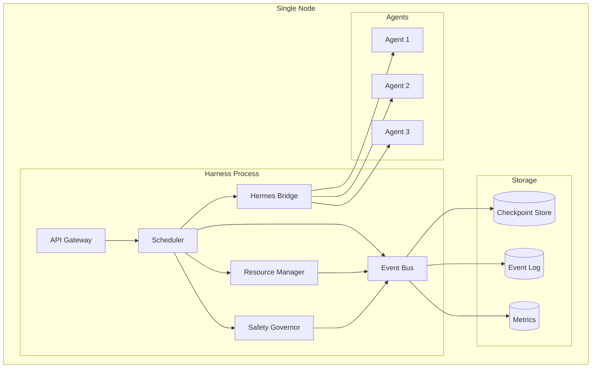
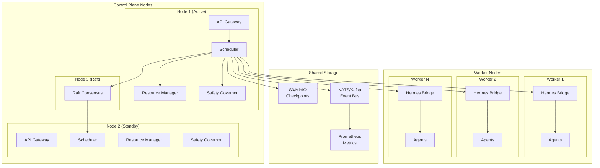
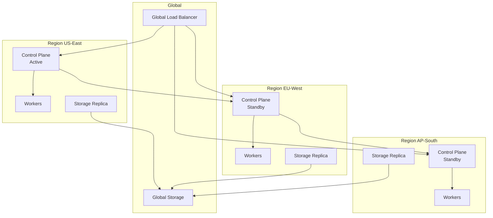

# AGI/ASI Harness — Deployment Architecture

**Document ID:** HARNESS-DEPLOY-001
**Version:** 1.0.0
**Date:** 2026-08-30
**Author:** agent-architect (Hermes Kanban)
**Classification:** Design Specification

---

## 1. Overview

This document describes the deployment architecture for the AGI/ASI Harness, covering single-node, multi-node, and multi-region deployment models, along with infrastructure requirements, networking, and operational procedures.

---

## 2. Deployment Models

### 2.1 Single-Node Deployment

**Use case:** Development, testing, small-scale production



**Requirements:**
- 16+ CPU cores
- 64 GB RAM
- 500 GB SSD
- Linux (Ubuntu 22.04+ recommended)

### 2.2 Multi-Node Deployment

**Use case:** Production, high availability



**Requirements (per control plane node):**
- 8+ CPU cores
- 32 GB RAM
- 200 GB SSD
- Linux

**Requirements (per worker node):**
- 16+ CPU cores
- 64 GB RAM
- 200 GB SSD
- Linux

### 2.3 Multi-Region Deployment

**Use case:** Global production, disaster recovery



---

## 3. Kubernetes Deployment

### 3.1 Namespace Structure

```
harness-system/
├── harness-control-plane/    # Control plane components
├── harness-workers/          # Agent worker nodes
├── harness-storage/          # Stateful services
├── harness-observability/    # Monitoring stack
└── harness-ingress/          # Ingress controllers
```

### 3.2 Control Plane Deployment

```yaml
apiVersion: apps/v1
kind: Deployment
metadata:
  name: harness-control-plane
  namespace: harness-system
spec:
  replicas: 2
  selector:
    matchLabels:
      app: harness-control-plane
  template:
    metadata:
      labels:
        app: harness-control-plane
    spec:
      containers:
        - name: control-plane
          image: harness/control-plane:1.0.0
          ports:
            - containerPort: 8080  # HTTP API
            - containerPort: 8081  # gRPC API
            - containerPort: 9090  # Metrics
          env:
            - name: HARNESS_ROLE
              value: "control-plane"
            - name: RAFT_PEERS
              value: "harness-control-plane-0:12000,harness-control-plane-1:12000"
            - name: STORAGE_BACKEND
              value: "s3"
            - name: EVENT_BUS_BACKEND
              value: "nats"
          resources:
            requests:
              cpu: "4"
              memory: "8Gi"
            limits:
              cpu: "8"
              memory: "16Gi"
          livenessProbe:
            httpGet:
              path: /health
              port: 8080
            initialDelaySeconds: 10
            periodSeconds: 5
          readinessProbe:
            httpGet:
              path: /ready
              port: 8080
            initialDelaySeconds: 5
            periodSeconds: 3
---
apiVersion: v1
kind: Service
metadata:
  name: harness-control-plane
  namespace: harness-system
spec:
  selector:
    app: harness-control-plane
  ports:
    - name: http
      port: 80
      targetPort: 8080
    - name: grpc
      port: 81
      targetPort: 8081
    - name: metrics
      port: 9090
      targetPort: 9090
```

### 3.3 Worker Deployment

```yaml
apiVersion: apps/v1
kind: DaemonSet
metadata:
  name: harness-worker
  namespace: harness-system
spec:
  selector:
    matchLabels:
      app: harness-worker
  template:
    metadata:
      labels:
        app: harness-worker
    spec:
      containers:
        - name: worker
          image: harness/worker:1.0.0
          ports:
            - containerPort: 8080
          env:
            - name: HARNESS_ROLE
              value: "worker"
            - name: CONTROL_PLANE_ENDPOINT
              value: "harness-control-plane:81"
            - name: HERMES_ENDPOINT
              valueFrom:
                secretKeyRef:
                  name: harness-secrets
                  key: hermes-endpoint
          resources:
            requests:
              cpu: "8"
              memory: "16Gi"
            limits:
              cpu: "16"
              memory: "32Gi"
```

### 3.4 Storage

```yaml
apiVersion: apps/v1
kind: StatefulSet
metadata:
  name: harness-storage
  namespace: harness-system
spec:
  serviceName: harness-storage
  replicas: 3
  selector:
    matchLabels:
      app: harness-storage
  template:
    metadata:
      labels:
        app: harness-storage
    spec:
      containers:
        - name: minio
          image: minio/minio:latest
          args:
            - server
            - --console-address
            - ":9001"
            - http://harness-storage-{0...2}/data
          ports:
            - containerPort: 9000
            - containerPort: 9001
          volumeMounts:
            - name: data
              mountPath: /data
          resources:
            requests:
              cpu: "2"
              memory: "4Gi"
  volumeClaimTemplates:
    - metadata:
        name: data
      spec:
        accessModes: ["ReadWriteOnce"]
        resources:
          requests:
            storage: 500Gi
```

### 3.5 Event Bus (NATS)

```yaml
apiVersion: apps/v1
kind: StatefulSet
metadata:
  name: nats
  namespace: harness-system
spec:
  serviceName: nats
  replicas: 3
  selector:
    matchLabels:
      app: nats
  template:
    metadata:
      labels:
        app: nats
    spec:
      containers:
        - name: nats
          image: nats:2.10-alpine
          ports:
            - containerPort: 4222  # Client
            - containerPort: 8222  # HTTP
            - containerPort: 6222  # Cluster
          args:
            - "--cluster"
            - "nats://nats-0.nats:6222,nats://nats-1.nats:6222,nats://nats-2.nats:6222"
            - "--store_dir"
            - "/data"
          volumeMounts:
            - name: data
              mountPath: /data
          resources:
            requests:
              cpu: "2"
              memory: "4Gi"
  volumeClaimTemplates:
    - metadata:
        name: data
      spec:
        accessModes: ["ReadWriteOnce"]
        resources:
          requests:
            storage: 100Gi
```

---

## 4. Infrastructure Requirements

### 4.1 Compute

| Component | Min CPU | Min RAM | Recommended CPU | Recommended RAM |
|-----------|---------|---------|-----------------|-----------------|
| Control Plane | 4 cores | 8 GB | 8 cores | 16 GB |
| Worker Node | 8 cores | 16 GB | 16 cores | 32 GB |
| Storage Node | 2 cores | 4 GB | 4 cores | 8 GB |
| Event Bus | 2 cores | 4 GB | 4 cores | 8 GB |

### 4.2 Storage

| Store | Type | Min Size | IOPS | Retention |
|-------|------|----------|------|-----------|
| Checkpoints | SSD | 500 GB | 3000+ | 7 days |
| Event Log | SSD | 200 GB | 3000+ | 7 days |
| Metrics | SSD | 100 GB | 1000+ | 30 days |
| Plugin Data | SSD | 50 GB | 1000+ | Forever |

### 4.3 Network

| Connection | Bandwidth | Latency | Protocol |
|------------|-----------|---------|----------|
| Client → API | 100 Mbps | < 50ms | HTTPS/gRPC |
| Control → Worker | 1 Gbps | < 5ms | gRPC |
| Control → Storage | 1 Gbps | < 10ms | S3 API |
| Control → Event Bus | 1 Gbps | < 5ms | NATS |
| Cross-region | 100 Mbps | < 100ms | gRPC/TLS |

---

## 5. Networking

### 5.1 Network Policies

```yaml
apiVersion: networking.k8s.io/v1
kind: NetworkPolicy
metadata:
  name: harness-control-plane
  namespace: harness-system
spec:
  podSelector:
    matchLabels:
      app: harness-control-plane
  policyTypes:
    - Ingress
    - Egress
  ingress:
    - from:
        - namespaceSelector:
            matchLabels:
              name: harness-ingress
        - podSelector:
            matchLabels:
              app: harness-worker
      ports:
        - port: 8080
        - port: 8081
  egress:
    - to:
        - podSelector:
            matchLabels:
              app: harness-worker
        - podSelector:
            matchLabels:
              app: harness-storage
        - podSelector:
            matchLabels:
              app: nats
```

### 5.2 Ingress Configuration

```yaml
apiVersion: networking.k8s.io/v1
kind: Ingress
metadata:
  name: harness-ingress
  namespace: harness-system
  annotations:
    nginx.ingress.kubernetes.io/ssl-redirect: "true"
    nginx.ingress.kubernetes.io/proxy-body-size: "10m"
    cert-manager.io/cluster-issuer: "letsencrypt-prod"
spec:
  tls:
    - hosts:
        - harness.example.com
      secretName: harness-tls
  rules:
    - host: harness.example.com
      http:
        paths:
          - path: /
            pathType: Prefix
            backend:
              service:
                name: harness-control-plane
                port:
                  number: 80
```

### 5.3 Service Mesh (Optional)

For advanced traffic management, use Istio/Linkerd:
- mTLS between all services
- Circuit breaking
- Retry policies
- Traffic splitting for canary deployments

---

## 6. Security Configuration

### 6.1 Secrets Management

```yaml
apiVersion: v1
kind: Secret
metadata:
  name: harness-secrets
  namespace: harness-system
type: Opaque
stringData:
  hermes-endpoint: "https://hermes.internal/api"
  hermes-api-key: "<REDACTED>
  openai-api-key: "<REDACTED>
  anthropic-api-key: "<REDACTED>
  brave-api-key: "<REDACTED>
  s3-access-key: "<REDACTED>
  s3-secret-key: "<REDACTED>
```

### 6.2 RBAC

```yaml
apiVersion: rbac.authorization.k8s.io/v1
kind: Role
metadata:
  name: harness-control-plane
  namespace: harness-system
rules:
  - apiGroups: [""]
    resources: ["pods", "services", "endpoints"]
    verbs: ["get", "list", "watch"]
  - apiGroups: ["apps"]
    resources: ["deployments", "replicasets"]
    verbs: ["get", "list", "watch"]
---
apiVersion: rbac.authorization.k8s.io/v1
kind: RoleBinding
metadata:
  name: harness-control-plane
  namespace: harness-system
subjects:
  - kind: ServiceAccount
    name: harness-control-plane
    namespace: harness-system
roleRef:
  kind: Role
  name: harness-control-plane
  apiGroup: rbac.authorization.k8s.io
```

### 6.3 Pod Security

```yaml
apiVersion: policy/v1beta1
kind: PodSecurityPolicy
metadata:
  name: harness-restricted
spec:
  privileged: false
  runAsUser:
    rule: MustRunAsNonRoot
  fsGroup:
    rule: MustRunAs
    ranges:
      - min: 1
        max: 65535
  volumes:
    - configMap
    - secret
    - persistentVolumeClaim
    - emptyDir
```

---

## 7. Observability Stack

### 7.1 Prometheus

```yaml
apiVersion: monitoring.coreos.com/v1
kind: ServiceMonitor
metadata:
  name: harness-metrics
  namespace: harness-system
spec:
  selector:
    matchLabels:
      app: harness-control-plane
  endpoints:
    - port: metrics
      interval: 15s
      path: /metrics
```

### 7.2 Grafana Dashboards

Pre-configured dashboards:
- **System Overview:** Task throughput, latency, error rates
- **Resource Utilization:** Token usage, memory, CPU per agent
- **Safety Events:** Gate decisions, escalations, e-stops
- **Agent Health:** Active agents, failure rates, recovery times

### 7.3 Alerting Rules

```yaml
apiVersion: monitoring.coreos.com/v1
kind: PrometheusRule
metadata:
  name: harness-alerts
  namespace: harness-system
spec:
  groups:
    - name: harness.rules
      rules:
        - alert: HighTaskFailureRate
          expr: rate(harness_tasks_failed_total[5m]) / rate(harness_tasks_submitted_total[5m]) > 0.1
          for: 5m
          labels:
            severity: warning
          annotations:
            summary: "High task failure rate (>10%)"
        
        - alert: SafetyGateDeniedSpike
          expr: rate(harness_safety_denials_total[5m]) > 10
          for: 2m
          labels:
            severity: critical
          annotations:
            summary: "Spike in safety gate denials"
        
        - alert: AgentCrashLoop
          expr: rate(harness_agent_restarts_total[10m]) > 0.5
          for: 5m
          labels:
            severity: warning
          annotations:
            summary: "Agent in crash loop"
        
        - alert: ResourceExhaustion
          expr: harness_resource_utilization > 0.9
          for: 5m
          labels:
            severity: critical
          annotations:
            summary: "Resource utilization >90%"
```

---

## 8. Backup and Recovery

### 8.1 Backup Strategy

| Data | Frequency | Retention | Method |
|------|-----------|-----------|--------|
| Checkpoints | Continuous | 7 days | S3 replication |
| Event Log | Continuous | 90 days | S3 replication |
| Configuration | On change | Forever | Git + S3 |
| Metrics | 15s scrape | 30 days | Prometheus TSDB |

### 8.2 Disaster Recovery

**RPO (Recovery Point Objective):** < 1 minute
**RTO (Recovery Time Objective):** < 2 minutes

**Recovery procedure:**
1. Detect failure (automated health checks)
2. Promote standby control plane
3. Restore latest checkpoint from S3
4. Reconnect workers
5. Resume task dispatching

---

## 9. Scaling Operations

### 9.1 Horizontal Pod Autoscaling

```yaml
apiVersion: autoscaling/v2
kind: HorizontalPodAutoscaler
metadata:
  name: harness-control-plane
  namespace: harness-system
spec:
  scaleTargetRef:
    apiVersion: apps/v1
    kind: Deployment
    name: harness-control-plane
  minReplicas: 2
  maxReplicas: 5
  metrics:
    - type: Resource
      resource:
        name: cpu
        target:
          type: Utilization
          averageUtilization: 70
    - type: Pods
      pods:
        metric:
          name: harness_pending_tasks
        target:
          type: AverageValue
          averageValue: "50"
```

### 9.2 Cluster Autoscaling

```yaml
apiVersion: k8s.aws/v1alpha1
kind: ClusterAutoscaler
metadata:
  name: harness-cluster
spec:
  scaleDown:
    enabled: true
    delayAfterAdd: 10m
    delayAfterDelete: 5m
    unneededTime: 5m
  scaleUp:
    delayAfterAdd: 2m
  resourceLimits:
    maxNodesTotal: 20
    maxCoresTotal: 320
    maxMemoryTotal: 640Gi
```

---

## 10. Upgrade Strategy

### 10.1 Rolling Updates

```yaml
apiVersion: apps/v1
kind: Deployment
metadata:
  name: harness-control-plane
spec:
  strategy:
    type: RollingUpdate
    rollingUpdate:
      maxUnavailable: 0
      maxSurge: 1
```

### 10.2 Canary Deployments

1. Deploy new version to 1 pod
2. Route 5% of traffic to canary
3. Monitor error rates and latency for 10 minutes
4. If healthy, gradually increase to 100%
5. If unhealthy, rollback automatically

### 10.3 Rollback Procedure

```bash
# Rollback to previous version
kubectl rollout undo deployment/harness-control-plane -n harness-system

# Verify rollback
kubectl rollout status deployment/harness-control-plane -n harness-system
```

---

## 11. Operational Runbooks

### 11.1 Emergency Stop

```bash
# Trigger e-stop
curl -X POST https://harness.example.com/v1/safety/estop \
  -H "Authorization: Bearer $TOKEN"

# Reset e-stop (requires manual confirmation)
curl -X POST https://harness.example.com/v1/safety/estop/reset \
  -H "Authorization: Bearer $TOKEN" \
  -d '{"confirmation": "I have reviewed the root cause"}'
```

### 11.2 Manual Failover

```bash
# Promote standby to active
kubectl exec -it harness-control-plane-1 -n harness-system -- \
  harness-cli failover promote

# Verify new active
kubectl exec -it harness-control-plane-1 -n harness-system -- \
  harness-cli status
```

### 11.3 Debugging

```bash
# Get component logs
kubectl logs -l app=harness-control-plane -n harness-system --tail=100

# Get scheduler state
kubectl exec -it harness-control-plane-0 -n harness-system -- \
  harness-cli scheduler dump

# Get safety gate history
kubectl exec -it harness-control-plane-0 -n harness-system -- \
  harness-cli safety history --last=1h
```

---

## Appendix A: Environment Variables

| Variable | Description | Default | Required |
|----------|-------------|---------|----------|
| `HARNESS_ROLE` | Component role | - | Yes |
| `HARNESS_LOG_LEVEL` | Log level | `info` | No |
| `HARNESS_HTTP_PORT` | HTTP API port | `8080` | No |
| `HARNESS_GRPC_PORT` | gRPC API port | `8081` | No |
| `HARNESS_METRICS_PORT` | Metrics port | `9090` | No |
| `RAFT_PEERS` | Raft peer addresses | - | Yes (control plane) |
| `STORAGE_BACKEND` | Storage backend type | `local` | No |
| `STORAGE_S3_BUCKET` | S3 bucket name | - | If S3 |
| `EVENT_BUS_BACKEND` | Event bus type | `in-memory` | No |
| `NATS_URLS` | NATS server URLs | - | If NATS |
| `HERMES_ENDPOINT` | Hermes API endpoint | - | Yes (workers) |
| `HERMES_API_KEY` | Hermes API key | - | Yes (workers) |
| `CONTROL_PLANE_ENDPOINT` | Control plane address | - | Yes (workers) |

## Appendix B: Port Reference

| Port | Protocol | Component | Description |
|------|----------|-----------|-------------|
| 8080 | HTTP | Control Plane | REST API |
| 8081 | gRPC | Control Plane | gRPC API |
| 9090 | HTTP | Control Plane | Prometheus metrics |
| 4222 | NATS | Event Bus | Client connections |
| 6222 | NATS | Event Bus | Cluster routes |
| 8222 | HTTP | Event Bus | Monitoring |
| 9000 | HTTP | Storage (MinIO) | S3 API |
| 9001 | HTTP | Storage (MinIO) | Console |
| 10250 | HTTPS | Kubelet | Node metrics |
