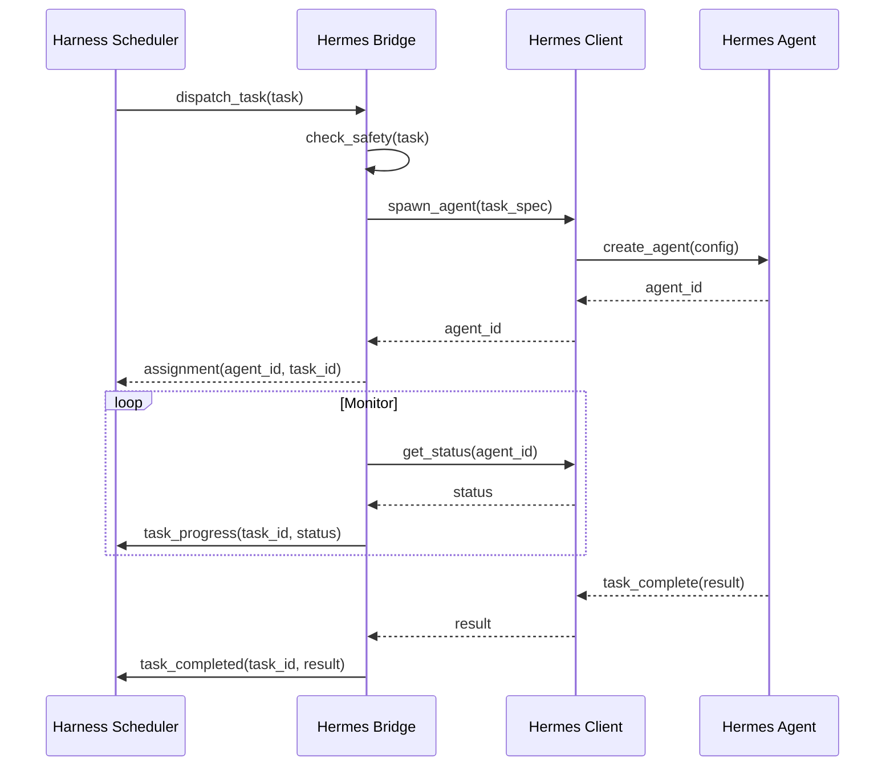
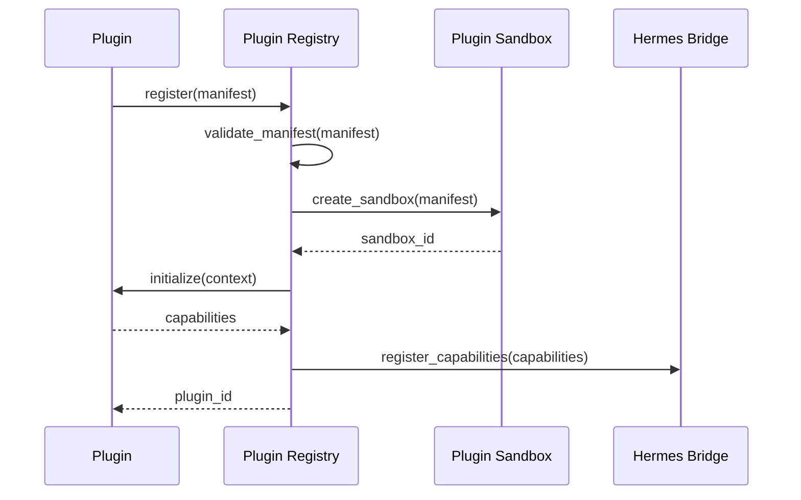
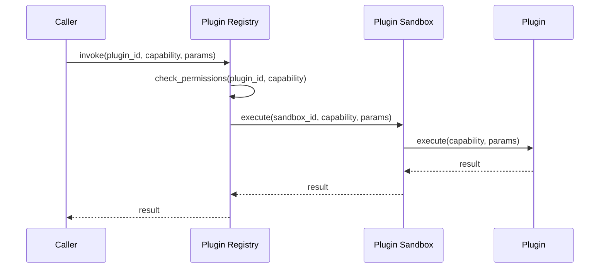
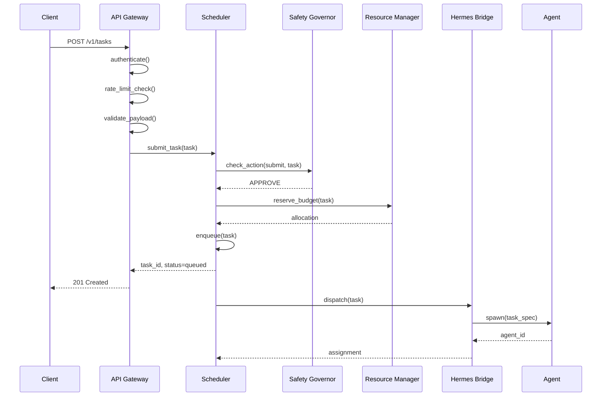
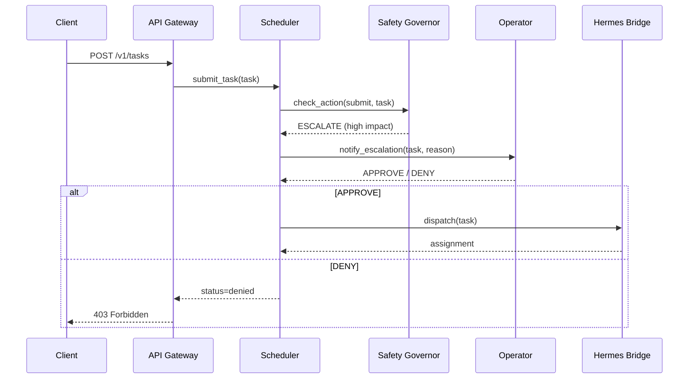

# AGI/ASI Harness — Integration Patterns

**Document ID:** HARNESS-INT-001
**Version:** 1.0.0
**Date:** 2026-08-30
**Author:** agent-architect (Hermes Kanban)
**Classification:** Design Specification

---

## 1. Overview

This document describes the integration patterns used within the AGI/ASI Harness, including inter-component communication, external system integration, and the protocols that bind the system together.

---

## 2. Inter-Component Communication Patterns

### 2.1 Command Pattern

Used for operations that trigger actions and expect a result.

```python
@dataclass
class Command:
    command_id: str
    timestamp: datetime
    source: str
    target: str
    action: str
    payload: dict
    timeout_seconds: float = 30.0

@dataclass
class CommandResult:
    command_id: str
    success: bool
    result: dict | None
    error: str | None
    duration_ms: float
```

**Usage:** API Gateway → Scheduler (submit task), Scheduler → Agent Bridge (dispatch task)

### 2.2 Event Pattern

Used for notifications that something has happened.

```python
@dataclass
class Event:
    event_id: str
    timestamp: datetime
    event_type: str
    source: str
    payload: dict
    trace_id: str

class EventBus:
    async def publish(self, topic: str, event: Event):
        """Publish event to a topic."""
    
    async def subscribe(self, topic: str, handler: Callable[[Event], Awaitable[None]]):
        """Subscribe to events on a topic."""
    
    async def subscribe_pattern(self, pattern: str, handler: Callable[[Event], Awaitable[None]]):
        """Subscribe to events matching a pattern (e.g., 'task.*.completed')."""
```

**Usage:** All components publish state changes; Recovery subscribes to failure events

### 2.3 Request-Response Pattern

Used for synchronous queries.

```python
@dataclass
class Request:
    request_id: str
    timestamp: datetime
    source: str
    target: str
    operation: str
    payload: dict

@dataclass
class Response:
    request_id: str
    status: int  # HTTP-like status code
    body: dict
    error: str | None
```

**Usage:** API Gateway → any component (status queries), Scheduler → Resource Manager (capacity check)

### 2.4 Streaming Pattern

Used for real-time data flows.

```python
class Stream(AsyncIterator[StreamFrame]):
    """A bidirectional stream between components."""
    
    async def send(self, frame: StreamFrame):
        """Send a frame on the stream."""
    
    async def receive(self) -> StreamFrame:
        """Receive the next frame."""
    
    async def close(self):
        """Close the stream."""
```

**Usage:** Agent Bridge → API Gateway (real-time task output), Event Bus → Monitor (live metrics)

---

## 3. Integration with Hermes Agent Framework

### 3.1 Hermes Bridge Protocol

The bridge translates between harness internal protocols and Hermes APIs.



### 3.2 Task Translation

**Harness Task → Hermes Agent Spec:**
```python
def translate_task_to_hermes(task: Task) -> HermesAgentSpec:
    return HermesAgentSpec(
        agent_type=task.type,
        goal=task.payload.get("query", ""),
        constraints={
            "max_tokens": task.estimated_cost.tokens,
            "max_duration": (task.deadline - datetime.now()).total_seconds(),
            "priority": task.priority,
        },
        safety_callback=hermes_safety_callback,
        tools=resolve_tools_for_task(task),
        memory_scope=task.auth_context.memory_scope,
    )
```

### 3.3 Status Mapping

| Hermes Agent Status | Harness Task Status | Notes |
|---------------------|---------------------|-------|
| spawning | scheduled | Agent being created |
| active | running | Agent executing |
| waiting | running | Agent waiting for tool result |
| paused | preempted | Agent paused by scheduler |
| completed | completed | Agent finished successfully |
| crashed | failed | Agent crashed |
| terminated | failed | Agent terminated by harness |

### 3.4 Resource Consumption Reporting

Hermes agents report resource consumption to the bridge, which forwards to the Resource Manager:

```python
@dataclass
class ResourceReport:
    agent_id: str
    task_id: str
    timestamp: datetime
    tokens_input: int
    tokens_output: int
    api_calls: dict[str, int]  # service -> count
    wall_time_ms: int
    memory_mb: float
```

---

## 4. External System Integration

### 4.1 LLM Provider Integration

```python
class LLMProvider(ABC):
    @abstractmethod
    async def generate(self, request: LLMRequest) -> LLMResponse:
        """Generate a completion."""
    
    @abstractmethod
    async def stream(self, request: LLMRequest) -> AsyncIterator[LLMChunk]:
        """Stream a completion."""
    
    @abstractmethod
    def get_cost(self, tokens_input: int, tokens_output: int) -> float:
        """Calculate cost for token usage."""

class OpenAIProvider(LLMProvider):
    """OpenAI API integration."""
    
class AnthropicProvider(LLMProvider):
    """Anthropic API integration."""
    
class LocalModelProvider(LLMProvider):
    """Local model (vLLM, Ollama) integration."""
```

### 4.2 Web Search Integration

```python
class WebSearchProvider(ABC):
    @abstractmethod
    async def search(self, query: str, max_results: int) -> list[SearchResult]:
        """Perform a web search."""

class BraveSearchProvider(WebSearchProvider):
    """Brave Search API integration."""
    
class SerpApiProvider(WebSearchProvider):
    """SerpAPI integration."""
```

### 4.3 Storage Integration

```python
class StorageBackend(ABC):
    @abstractmethod
    async def write(self, key: str, data: bytes, metadata: dict):
        """Write data to storage."""
    
    @abstractmethod
    async def read(self, key: str) -> bytes:
        """Read data from storage."""
    
    @abstractmethod
    async def delete(self, key: str):
        """Delete data from storage."""
    
    @abstractmethod
    async def list(self, prefix: str) -> list[str]:
        """List keys with prefix."""

class S3Storage(StorageBackend):
    """AWS S3 / MinIO integration."""

class NFSStorage(StorageBackend):
    """NFS mount integration."""

class LocalStorage(StorageBackend):
    """Local filesystem (for development)."""
```

### 4.4 Observability Integration

```python
class MetricsExporter(ABC):
    @abstractmethod
    async def export_metrics(self, metrics: list[Metric]):
        """Export metrics to external system."""

class PrometheusExporter(MetricsExporter):
    """Prometheus pushgateway / scrape target."""

class DatadogExporter(MetricsExporter):
    """Datadog integration."""

class OTelExporter(MetricsExporter):
    """OpenTelemetry collector."""
```

---

## 5. API Gateway Integration

### 5.1 HTTP API

**Authentication:**
- API keys (for programmatic access)
- OAuth2 tokens (for user-facing access)
- mTLS (for service-to-service)

**Rate Limiting:**
- Token bucket per client
- Configurable per-endpoint limits
- Returns `429 Too Many Requests` with `Retry-After` header

**Error Responses:**
```json
{
  "error": {
    "code": "RATE_LIMITED",
    "message": "Rate limit exceeded",
    "details": {
      "limit": 100,
      "window": "60s",
      "retry_after": "30s"
    }
  }
}
```

### 5.2 gRPC API

```protobuf
service HarnessService {
  rpc SubmitTask(SubmitTaskRequest) returns (TaskResponse);
  rpc GetTaskStatus(GetTaskStatusRequest) returns (TaskStatusResponse);
  rpc CancelTask(CancelTaskRequest) returns (CancelTaskResponse);
  rpc WatchTask(WatchTaskRequest) returns (stream TaskEvent);
  rpc ListAgents(Empty) returns (AgentList);
  rpc TriggerEStop(Empty) returns (EStopResponse);
  rpc ResetEStop(Empty) returns (EStopResponse);
  rpc GetMetrics(Empty) returns (MetricsResponse);
}
```

### 5.3 WebSocket API

For real-time updates to clients:
- Task status changes
- Safety gate events
- Agent output streams
- System metrics

---

## 6. Plugin Integration

### 6.1 Plugin Registration Flow



### 6.2 Plugin Invocation Flow



### 6.3 Plugin Event Hooks

Plugins can register hooks for harness events:

| Event | When Fired | Use Case |
|-------|------------|----------|
| `harness.startup` | System starting | Initialize connections |
| `harness.shutdown` | System shutting down | Clean up resources |
| `task.submitted` | New task submitted | Pre-process tasks |
| `task.completed` | Task finished | Post-process results |
| `safety.decision` | Safety gate decision | Audit logging |
| `agent.spawned` | New agent created | Setup agent context |
| `agent.terminated` | Agent terminated | Cleanup agent context |

---

## 7. Event Bus Integration

### 7.1 Topic Naming Convention

```
harness.<component>.<entity>.<action>
```

Examples:
- `harness.scheduler.task.submitted`
- `harness.safety.gate.denied`
- `harness.agent.task.completed`
- `harness.resource.threshold.exceeded`

### 7.2 Subscription Patterns

| Subscriber | Subscribed Topics |
|------------|-------------------|
| Logger | `harness.#` (all events) |
| Monitor | `harness.*.task.*`, `harness.*.metric.*` |
| Audit Trail | `harness.safety.#` |
| Recovery | `harness.*.failed`, `harness.*.timeout` |
| Alert Manager | `harness.safety.denied`, `harness.resource.exhausted` |

### 7.3 Event Retention

- Events retained for 7 days (configurable)
- Safety events retained for 90 days (compliance)
- Events compressed after 24 hours (zstd)
- Consumers can replay from any point in time

---

## 8. Data Formats and Schemas

### 8.1 Task Schema (JSON)
```json
{
  "$schema": "http://json-schema.org/draft-07/schema#",
  "type": "object",
  "required": ["id", "type", "payload", "priority", "deadline"],
  "properties": {
    "id": { "type": "string", "format": "uuid" },
    "type": { "type": "string", "enum": ["research", "code", "analysis", "synthesis"] },
    "payload": { "type": "object" },
    "priority": { "type": "integer", "minimum": 0, "maximum": 10 },
    "deadline": { "type": "string", "format": "date-time" },
    "estimated_cost": {
      "type": "object",
      "properties": {
        "tokens": { "type": "integer" },
        "wall_time_ms": { "type": "integer" },
        "memory_mb": { "type": "number" }
      }
    },
    "dependencies": { "type": "array", "items": { "type": "string" } },
    "auth_context": {
      "type": "object",
      "properties": {
        "user_id": { "type": "string" },
        "scopes": { "type": "array", "items": { "type": "string" } }
      }
    },
    "metadata": { "type": "object" }
  }
}
```

### 8.2 Event Schema (JSON)
```json
{
  "$schema": "http://json-schema.org/draft-07/schema#",
  "type": "object",
  "required": ["event_id", "timestamp", "event_type", "source"],
  "properties": {
    "event_id": { "type": "string", "format": "uuid" },
    "timestamp": { "type": "string", "format": "date-time" },
    "event_type": { "type": "string", "pattern": "^harness\\.[a-z]+\\.[a-z]+\\.[a-z]+$" },
    "source": { "type": "string" },
    "task_id": { "type": ["string", "null"] },
    "payload": { "type": "object" },
    "trace_id": { "type": "string" },
    "span_id": { "type": "string" }
  }
}
```

---

## 9. Error Handling Patterns

### 9.1 Error Classification

| Category | HTTP Status | Retryable | Example |
|----------|-------------|-----------|---------|
| Validation Error | 400 | No | Invalid task payload |
| Authentication Error | 401 | No | Invalid API key |
| Authorization Error | 403 | No | Insufficient scope |
| Not Found | 404 | No | Task not found |
| Rate Limited | 429 | Yes | Too many requests |
| Internal Error | 500 | Yes | Component crash |
| Service Unavailable | 503 | Yes | System overloaded |

### 9.2 Circuit Breaker

```python
class CircuitBreaker:
    def __init__(self, failure_threshold: int = 5, recovery_timeout: int = 30):
        self.failure_threshold = failure_threshold
        self.recovery_timeout = recovery_timeout
        self.failures = 0
        self.last_failure_time: datetime | None = None
        self.state = CircuitState.CLOSED  # CLOSED, OPEN, HALF_OPEN
    
    async def call(self, func, *args, **kwargs):
        if self.state == CircuitState.OPEN:
            if self._should_try_reset():
                self.state = CircuitState.HALF_OPEN
            else:
                raise CircuitBreakerOpenError()
        
        try:
            result = await func(*args, **kwargs)
            self._on_success()
            return result
        except Exception as e:
            self._on_failure()
            raise
```

### 9.3 Retry with Backoff

```python
async def retry_with_backoff(
    func: Callable,
    max_attempts: int = 3,
    initial_delay: float = 1.0,
    max_delay: float = 60.0,
    backoff_multiplier: float = 2.0,
    retryable_exceptions: tuple = (TimeoutError, ConnectionError, RateLimitError),
):
    delay = initial_delay
    for attempt in range(max_attempts):
        try:
            return await func()
        except retryable_exceptions as e:
            if attempt == max_attempts - 1:
                raise
            await asyncio.sleep(delay)
            delay = min(delay * backoff_multiplier, max_delay)
```

---

## 10. Versioning Strategy

### 10.1 API Versioning
- URL path versioning: `/v1/tasks`, `/v2/tasks`
- Current version in response header: `X-API-Version: 1`
- Deprecated versions supported for 6 months
- Breaking changes only in major versions

### 10.2 Event Schema Versioning
- Events include schema version: `"schema_version": "1.0"`
- Consumers declare which schema versions they accept
- Schema evolution rules:
  - Additive changes: new optional fields (backward compatible)
  - Breaking changes: new event type with version suffix

### 10.3 Plugin API Versioning
- Plugin API version declared in manifest
- Harness supports plugin API versions N and N-1
- Plugin SDK provides compatibility shims

---

## Appendix A: Integration Sequence Diagrams

### A.1 Task Submission Flow



### A.2 Safety Escalation Flow


